# End-to-End Analysis Walkthrough (Rephrased, Minimal Condition)

This walkthrough follows the notebook order you requested and now explicitly documents the **actual tests used** in each section, with per-model results where available from notebook output cells.

Notebook order:
1. `compare_proposals_rephrased.ipynb`
2. `compare_reviews_ncems_criteria.ipynb`
3. `compare_reviews_novelty.ipynb`
4. `metric_score_relationship.ipynb`

---

## Methods Cheat Sheet

This section summarizes the core metric definitions used across the notebooks.

1. Distance function
- `d(a,b)` = cosine distance = `1 - cosine_similarity(a,b)` using `sklearn.metrics.pairwise.cosine_distances`.

2. Pairwise diversity (within group `g`)
- Proposals in group `g`: `x_1 ... x_n`.
- Descriptive pairwise set: all `d(x_i, x_j)` for `i<j`.
- Proposal-level inferential value:
  - `m_i = (1/(n-1)) * Σ_{j≠i} d(x_i, x_j)`
- Group comparisons are run on `{m_i}` (one value per proposal).

3. Centroid dispersion
- Group centroid:
  - `c_g = (1/n_g) * Σ_{i in g} x_i`
- Per-proposal centroid distance:
  - `cd_i = d(x_i, c_g)`

4. Nearest-neighbor isolation and outliers
- Global NN distance (all proposals pooled):
  - `nn_i = min_{j≠i} d(x_i, x_j)`
- Outlier threshold:
  - `τ = percentile_90({nn_i})`
- Outlier flag (as implemented):
  - `is_outlier_i = 1(nn_i > τ)` (strict `>`, not `>=`).
- Raw-space threshold reported in notebook: `τ = 0.0984`.

5. Raw literature novelty (`k=10`)
- Literature set `L`.
- Proposal `p` nearest literature set `N_k(p)`.
- Raw novelty:
  - `s_p = (1/k) * Σ_{ℓ in N_k(p)} d(p, ℓ)`

6. Local-density novelty normalization (`k=10`)
- For each literature article `a`, local literature baseline:
  - `b_a = (1/k) * Σ_{u in kNN_literature(a), u≠a} d(a, u)`
- For each proposal `p`:
  - `μ_p = mean({b_a : a in N_k(p)})`
  - `σ_p = std({b_a : a in N_k(p)})`
  - `z_p = (s_p - μ_p) / σ_p`
  - `ratio_p = s_p / μ_p`
- Edge handling in code:
  - if `σ_p ≈ 0`, use global literature SD in denominator;
  - if `μ_p ≈ 0`, `ratio_p = NaN`.

7. Style-adjusted embedding analyses
- Residualization:
  - Fit `E ≈ X B` from style covariates `X`.
  - Residual embeddings: `E_resid = E - X B`.
  - L2-normalize residual rows.
- Recompute distances in residual space.
- Style-adjusted NN outliers:
  - `nn_i^adj = min_{j≠i} d(E_resid_i, E_resid_j)`
  - `τ_adj = percentile_90({nn_i^adj})`
  - `is_outlier_i^adj = 1(nn_i^adj > τ_adj)`
- Reported residual-space threshold: `τ_adj = 0.5212`.

8. Inferential tests used repeatedly
- Mann-Whitney U test.
- Cliff’s delta effect size.
- Bootstrap 95% CI for mean difference.
- Permutation test for mean difference.
- Multiple-testing correction: Holm or FDR (as specified per section).

---

## 1) `compare_proposals_rephrased.ipynb`

### Dataset and embedding setup
- Proposal counts: Human `n=23`, Claude `n=23`, Gemini `n=23`, GPT-5.2 `n=23`, All AI `n=69`.
- Embeddings: BioLinkBERT-Large, cached matrices:
  - Human `(23, 1024)`
  - AI `(69, 1024)`

---

### PART I: Diversity (full proposal text)

## Analysis 1.1: Within-group pairwise diversity
**Main finding:** Human proposals were substantially more diverse than AI proposals on proposal-level pairwise distance, and this was statistically significant for All AI and each model vs Human after Holm correction (all Holm-adjusted MW `p <= 5.64e-03`). Effect sizes were large for All AI, Claude, and Gemini (`|δ| >= 0.768`), and medium-to-large for GPT-5.2 (`δ=-0.4783`).

### What was computed
- Pairwise cosine distances within each group.
- Inference at the proposal level used each proposal’s **mean distance to all other proposals in its group**.

### Exact metric definition
- Let `d(a,b)` be cosine distance between embeddings `a` and `b` (`d = 1 - cosine_similarity` via `sklearn.metrics.pairwise.cosine_distances`).
- For group `g` with proposals `x_1 ... x_n`, descriptive pairwise distances are all upper-triangle `d(x_i, x_j)` for `i<j`.
- For inference, each proposal gets one value:
  - `m_i = (1/(n-1)) * Σ_{j≠i} d(x_i, x_j)`
- Group-level inferential comparisons are performed on the set `{m_i}` (one value per proposal).

### Tests actually used
- **Mann-Whitney U test** (AI group vs Human).
- **Cliff’s delta** effect size.
- **Bootstrap 95% CI** for mean difference (AI − Human).
- **Permutation test** for mean difference.
- **Holm correction** across the 4 AI-vs-Human comparisons.

### Descriptive results
- Human: mean `0.4429`, median `0.4129`, SD `0.0481`
- Claude: mean `0.0337`, median `0.0326`, SD `0.0037`
- Gemini: mean `0.1505`, median `0.0978`, SD `0.1733`
- GPT-5.2: mean `0.3148`, median `0.2225`, SD `0.1588`
- All AI: mean `0.1826`, median `0.1196`, SD `0.1759`

### Inferential results (proposal-level)
- All AI vs Human: `U=184`, MW `p=3.9891e-08`, `δ=-0.7681`, mean diff `-0.2603`, 95% CI `[-0.3028, -0.2115]`, permutation `p=0.0001`, Holm MW `p=1.1967e-07`, Holm permutation `p=3.9996e-04`
- Claude vs Human: `U=0`, MW `p=6.6369e-09`, `δ=-1.0000`, mean diff `-0.4092`, 95% CI `[-0.4284, -0.3898]`, permutation `p=0.0001`, Holm MW `p=2.6548e-08`, Holm permutation `p=3.9996e-04`
- Gemini vs Human: `U=46`, MW `p=1.6738e-06`, `δ=-0.8261`, mean diff `-0.2925`, 95% CI `[-0.3548, -0.2087]`, permutation `p=0.0001`, Holm MW `p=3.3476e-06`, Holm permutation `p=3.9996e-04`
- GPT-5.2 vs Human: `U=138`, MW `p=5.6381e-03`, `δ=-0.4783`, mean diff `-0.1281`, 95% CI `[-0.1914, -0.0563]`, permutation `p=0.0013`, Holm MW `p=5.6381e-03`, Holm permutation `p=1.2999e-03`

**Interpretation**
- Full-text semantic diversity is substantially higher in Human proposals than in all AI groups.

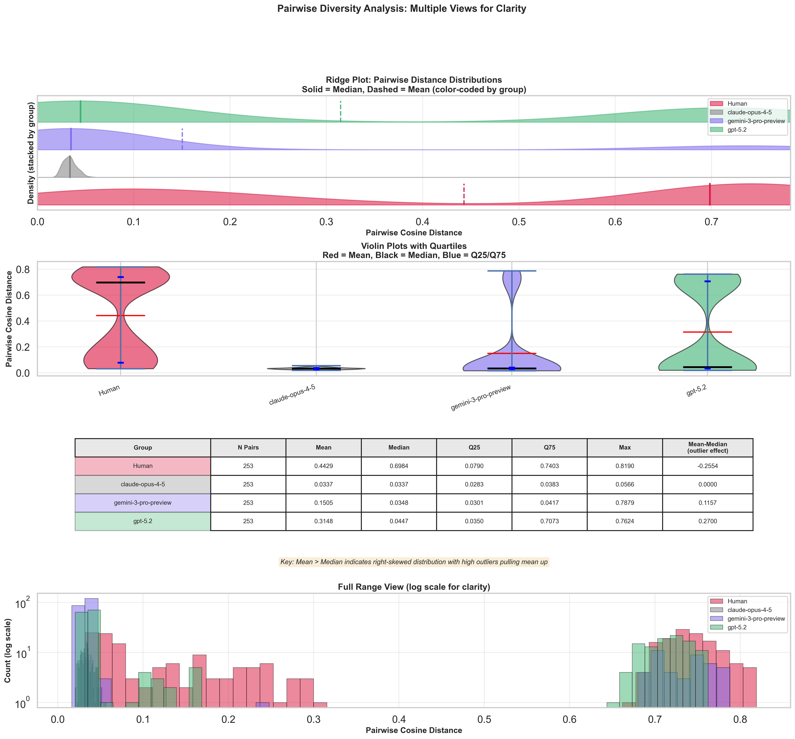
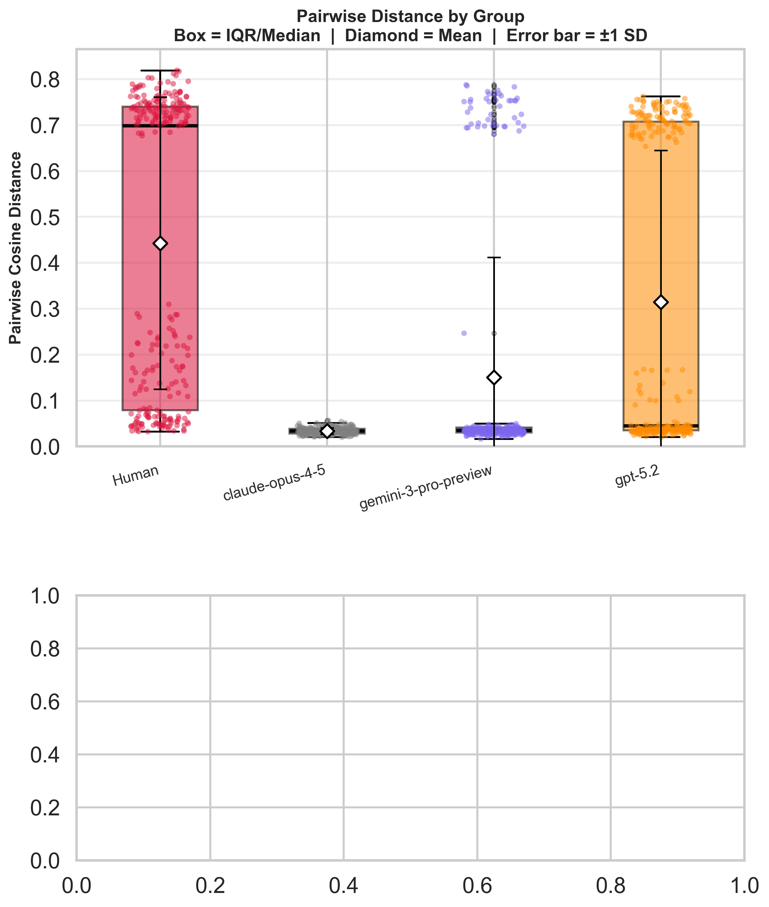

## Analysis 1.2: Centroid dispersion
**Main finding:** Human proposals were more dispersed from their group centroid than All AI and each individual model, with significant Mann-Whitney results after Holm correction (including GPT-5.2: Holm MW `p=5.6381e-03`). The direction and large effect sizes for most comparisons (`δ` from `-0.4783` to `-1.0000`) matched the pairwise-diversity result.

### What was computed
- Group centroid embedding.
- Per-proposal cosine distance to own group centroid.

### Exact metric definition
- For each group `g`, centroid is the arithmetic mean embedding:
  - `c_g = (1/n_g) * Σ_{i in g} x_i`
- Per-proposal centroid distance:
  - `cd_i = d(x_i, c_g)` where `d` is cosine distance.
- Reported group summaries are mean/median/SD of `{cd_i}` in each group.

### Tests actually used
- **Mann-Whitney U**, **Cliff’s delta**, **bootstrap 95% CI**, **permutation test**, **Holm correction**.

### Descriptive results
- Human: mean `0.2413`, median `0.2236`, SD `0.0411`
- Claude: mean `0.0163`, median `0.0151`, SD `0.0036`
- Gemini: mean `0.0748`, median `0.0209`, SD `0.1770`
- GPT-5.2: mean `0.1643`, median `0.0664`, SD `0.1685`
- All AI: mean `0.0945`, median `0.0274`, SD `0.1876`

### Inferential results
- All AI vs Human: `U=184`, MW `p=3.9891e-08`, `δ=-0.7681`, mean diff `-0.1468`, 95% CI `[-0.1905, -0.0965]`, permutation `p=0.0005`, Holm MW `p=1.1967e-07`
- Claude vs Human: `U=0`, MW `p=6.6369e-09`, `δ=-1.0000`, mean diff `-0.2251`, 95% CI `[-0.2417, -0.2083]`, permutation `p=0.0001`, Holm MW `p=2.6548e-08`
- Gemini vs Human: `U=46`, MW `p=1.6738e-06`, `δ=-0.8261`, mean diff `-0.1666`, 95% CI `[-0.2285, -0.0816]`, permutation `p=0.0002`, Holm MW `p=3.3476e-06`
- GPT-5.2 vs Human: `U=138`, MW `p=5.6381e-03`, `δ=-0.4783`, mean diff `-0.0770`, 95% CI `[-0.1428, -0.0025]`, permutation `p=0.0448`, Holm MW `p=5.6381e-03`

**Interpretation**
- Human proposals are more dispersed from group center than each AI model.

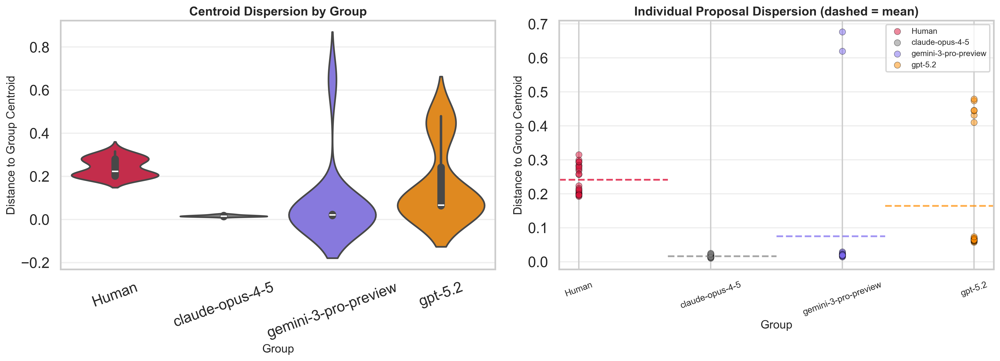

## Analysis 1.3: Nearest-neighbor outlier detection
**Main finding:** Human proposals were more isolated in semantic space than AI proposals (mean NN `0.0739` vs `0.0323` for All AI), and these differences were significant for All AI and each model (Holm-adjusted MW `p <= 3.35e-03`). Outlier prevalence was much higher for Human (`30.4%`) than All AI (`4.3%`) under the global top-10% NN rule.

### What was computed
- Global nearest-neighbor (NN) distance for each proposal in combined Human+AI space.
- Outliers defined as top 10% NN distances.

### Exact metric definition
- Stack all proposals (Human + all AI models) into one embedding matrix.
- For each proposal `i`, compute nearest-neighbor distance:
  - `nn_i = min_{j≠i} d(x_i, x_j)`
- Outlier threshold is the 90th percentile of all `nn_i` values:
  - `τ = percentile_90({nn_i})`
- Outlier indicator (as implemented) is **strict**:
  - `is_outlier_i = 1(nn_i > τ)`
- In this raw-space analysis, `τ = 0.0984`.

### Tests actually used
- **Mann-Whitney U**, **Cliff’s delta**, **bootstrap 95% CI**, **permutation test**, **Holm correction**.

### Descriptive results
- Human: mean NN `0.0739`, median `0.0369`, min `0.0189`, max `0.2135`
- Claude: mean NN `0.0234`, median `0.0233`, min `0.0189`, max `0.0310`
- Gemini: mean NN `0.0326`, median `0.0234`, min `0.0164`, max `0.1854`
- GPT-5.2: mean NN `0.0408`, median `0.0266`, min `0.0187`, max `0.1129`
- All AI: mean NN `0.0323`, median `0.0238`, min `0.0164`, max `0.1854`
- Outlier threshold: `0.0984`
- Outlier counts:
  - Human `7/23 (30.4%)`
  - Claude `0/23 (0.0%)`
  - Gemini `1/23 (4.3%)`
  - GPT-5.2 `2/23 (8.7%)`
  - All AI `3/69 (4.3%)`

### Inferential results
- All AI vs Human: `U=256`, MW `p=1.2828e-06`, `δ=-0.6774`, mean diff `-0.0416`, 95% CI `[-0.0668, -0.0188]`, permutation `p=0.0001`, Holm MW `p=5.1314e-06`
- Claude vs Human: `U=50`, MW `p=2.4378e-06`, `δ=-0.8129`, mean diff `-0.0505`, 95% CI `[-0.0741, -0.0285]`, permutation `p=0.0001`, Holm MW `p=7.3135e-06`
- Gemini vs Human: `U=76`, MW `p=3.6184e-05`, `δ=-0.7127`, mean diff `-0.0413`, 95% CI `[-0.0687, -0.0143]`, permutation `p=0.0045`, Holm MW `p=7.2367e-05`
- GPT-5.2 vs Human: `U=130`, MW `p=3.3544e-03`, `δ=-0.5066`, mean diff `-0.0331`, 95% CI `[-0.0594, -0.0079]`, permutation `p=0.0175`, Holm MW `p=3.3544e-03`

**Interpretation**
- In unadjusted embedding space, Human proposals are substantially more isolated/outlier-like.

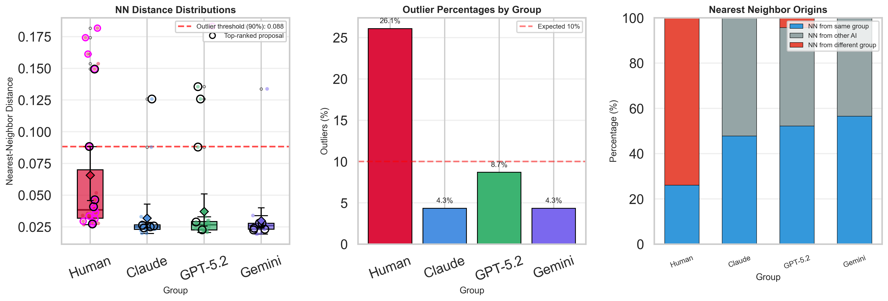

## Analysis 1.4: Embedding-space visualization
**Main finding:** UMAP/t-SNE plots were used as qualitative checks and were consistent with the numeric diversity/isolation findings (Human points occupying more remote regions). This section is descriptive and does not add a new significance test.

### What was done
- 2D UMAP and t-SNE projections.
- Outlier overlay from NN threshold.

### Notes from outputs
- UMAP completed on all 92 proposals.
- Diagnostic checks confirmed NN-threshold consistency.

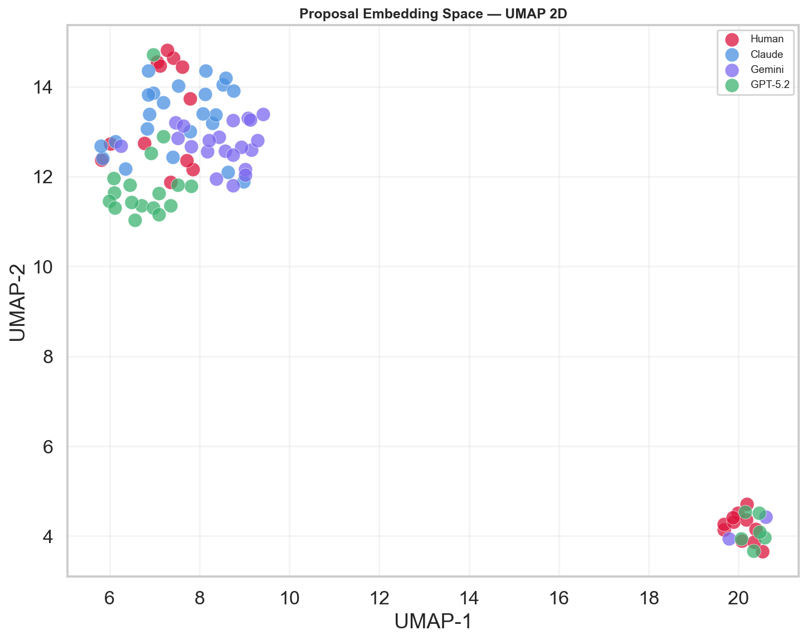
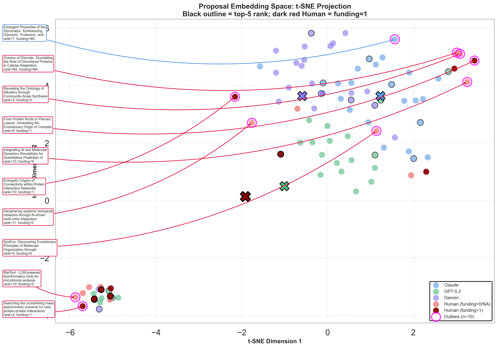

---

### Main-idea analyses (1-B series)

## Analysis 1-B.1: Pairwise diversity of main ideas
**Main finding:** On compressed “main idea” embeddings, AI groups still showed lower pairwise diversity than Human in Mann-Whitney tests (e.g., All AI MW `p=1.0740e-10`, `δ=-0.9030`). However, permutation results were mixed (strongest robustness for Gemini; weaker for All AI/Claude/GPT-5.2), so evidence is strongest for model-specific effects rather than uniformly robust across all comparisons.

### Tests actually used
- **Mann-Whitney U**, **Cliff’s delta**, **permutation test**, Holm-adjusted reporting table.

### Descriptive results
- Human mean `0.1534`
- Claude mean `0.1155`
- Gemini mean `0.0664`
- GPT-5.2 mean `0.1650`
- All AI mean `0.1198`

### Inferential results (vs Human)
- All AI: `δ=-0.9030`, MW `p=1.0740e-10`, permutation `p=0.2834`, mean diff `-0.0336`, 95% CI `[-0.0927, 0.0137]`
- Claude: `δ=-0.9130`, MW `p=1.1930e-07`, permutation `p=0.4746`, mean diff `-0.0378`, 95% CI `[-0.1102, 0.0388]`
- Gemini: `δ=-1.0000`, MW `p=6.6369e-09`, permutation `p=0.0001`, mean diff `-0.0870`, 95% CI `[-0.1385, -0.0580]`
- GPT-5.2: `δ=-0.4102`, MW `p=1.7660e-02`, permutation `p=0.9991`, mean diff `0.0116`, 95% CI `[-0.0617, 0.1009]`

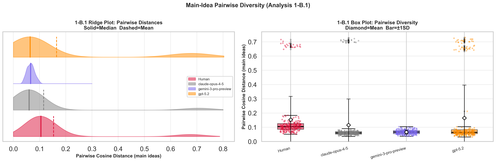

## Analysis 1-B.2: Main-idea centroid dispersion
**Main finding:** Main-idea centroid dispersion was lower for AI than Human across all models, with significant MW tests (All AI MW `p=3.1350e-06`). Permutation support was again strongest for Gemini and weaker for other model contrasts.

### Tests actually used
- **Mann-Whitney U**, **Cliff’s delta**, **permutation test**.

### Descriptive results
- Human `0.0763`, Claude `0.0569`, Gemini `0.0323`, GPT-5.2 `0.0824`, All AI `0.0609`

### Inferential results
- All AI vs Human: `δ=-0.6522`, MW `p=3.1350e-06`, permutation `p=0.5584`
- Claude vs Human: `δ=-0.8034`, MW `p=3.2012e-06`, permutation `p=0.4877`
- Gemini vs Human: `δ=-0.7732`, MW `p=7.4046e-06`, permutation `p=0.0001`
- GPT-5.2 vs Human: `δ=-0.6181`, MW `p=3.4231e-04`, permutation `p=1.0000`

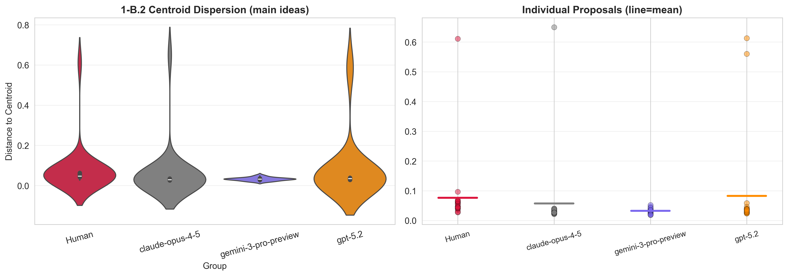

## Analysis 1-B.3: Main-idea NN distances
**Main finding:** Human main ideas were more isolated than AI main ideas, with significant MW and permutation evidence across All AI and each model (e.g., All AI MW `p=1.4274e-07`, permutation `p=0.0001`). Human also had more main-idea outliers (`9`) than All AI (`1`).

### Tests actually used
- **Mann-Whitney U**, **Cliff’s delta**, **permutation test**.

### Descriptive results
- Mean NN: Human `0.0622`, Claude `0.0400`, Gemini `0.0433`, GPT-5.2 `0.0460`, All AI `0.0431`
- Outliers: Human `9`, Claude `0`, Gemini `0`, GPT-5.2 `1`, All AI `1`
- Threshold: `0.0693`

### Inferential results
- All AI vs Human: `δ=-0.7360`, MW `p=1.4274e-07`, permutation `p=0.0001`
- Claude vs Human: `δ=-0.8166`, MW `p=2.1928e-06`, permutation `p=0.0001`
- Gemini vs Human: `δ=-0.7089`, MW `p=3.9804e-05`, permutation `p=0.0002`
- GPT-5.2 vs Human: `δ=-0.6824`, MW `p=7.6632e-05`, permutation `p=0.0061`

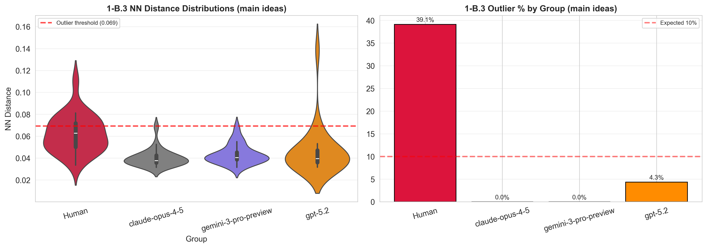

## Analysis 1-B.4 and 1-B.5
**Main finding:** Main-idea UMAP provided qualitative structure checks, and overlap-threshold analysis (`0.8`) showed high cross-group overlap (near-complete human↔AI matching) with few distinct concepts per group. These are descriptive diagnostics rather than primary significance tests.
- 1-B.4: UMAP visualization on main-idea embeddings.
- 1-B.5: concept overlap threshold `0.8`; Human distinct concepts `2`, All AI `2`; cross-group overlap near complete.

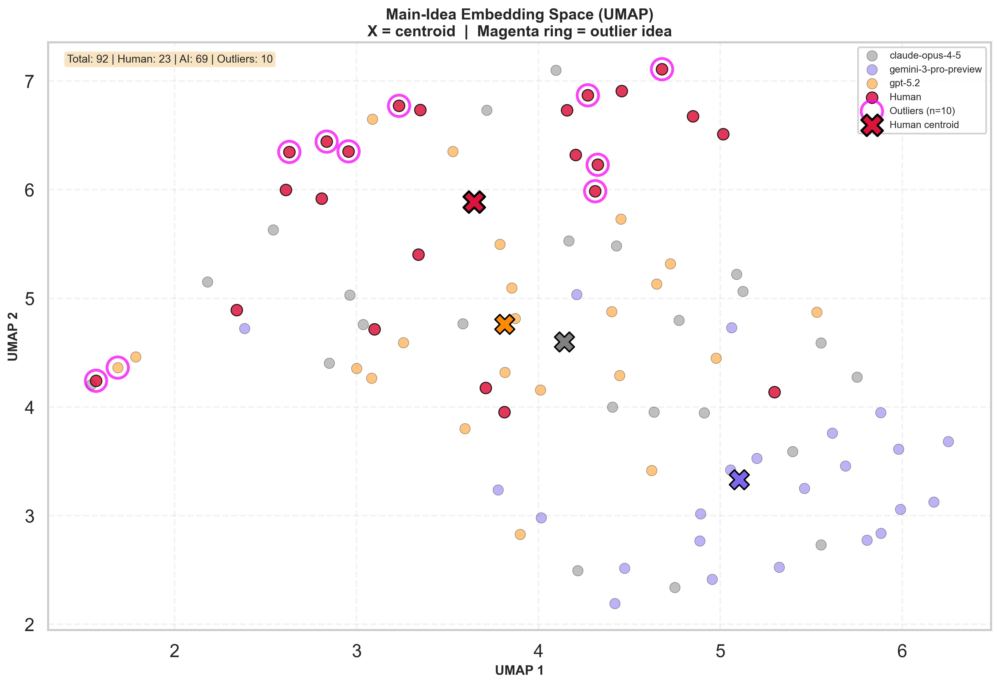
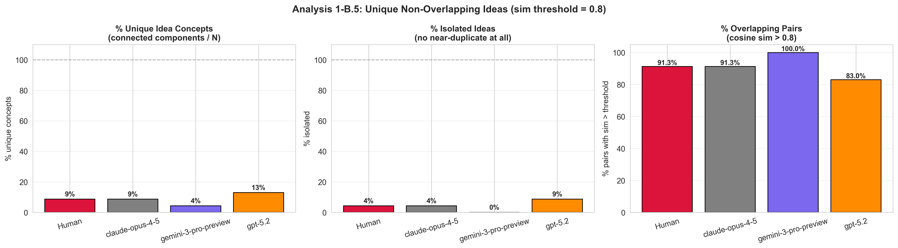

---

### PART II: Novelty against literature corpus

## Step 1-2: Literature corpus and embedding
**Main finding:** A large domain-specific reference corpus (`n=1030`) was embedded in the same space as proposals to anchor novelty estimation. This is setup/context, not a hypothesis test.
- Corpus loaded: `1030` PubMed abstracts from `35` query categories.
- Same embedding model family used for proposals and literature.

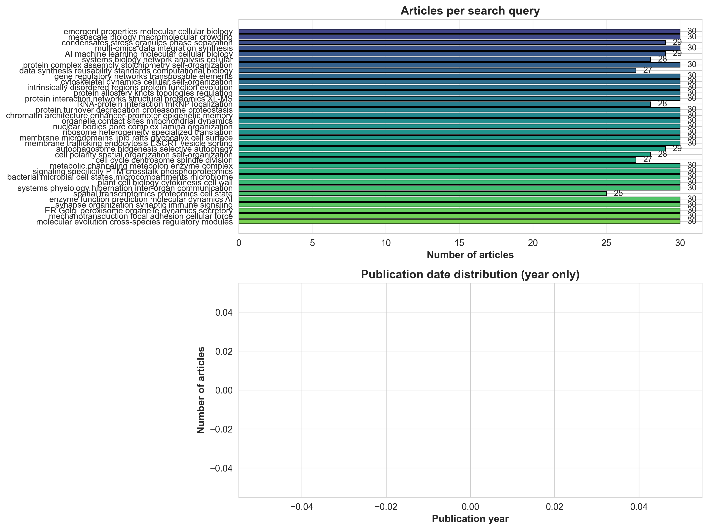

## Step 4b: Local-density normalized novelty
**Main finding:** After local-density normalization, AI-vs-Human novelty differences were not statistically significant (All AI vs Human MW `p=0.9138`, `δ=0.0158`; all model comparisons also non-significant after Holm). This indicates that much of raw novelty separation is explained by differences in local literature density around proposals.

### What was computed
- Raw novelty: mean distance to 10 nearest literature neighbors.
- Local-density normalization outputs:
  - z-score relative to local literature density
  - ratio relative to local baseline mean

### Exact metric definition (raw novelty)
- Let `L` be literature embeddings and `k=10`.
- For proposal `p`, compute distances to all literature articles, take its `k` nearest:
  - `N_k(p) = kNN_literature(p)`
- Raw novelty score:
  - `s_p = (1/k) * Σ_{ℓ in N_k(p)} d(p, ℓ)`

### Exact metric definition (local-density normalization)
- First compute a within-literature local density baseline for each literature article `a`:
  - `b_a = (1/k) * Σ_{u in kNN_literature(a), u≠a} d(a, u)`
  - (Self-distance is excluded by setting diagonal to `inf`.)
- For each proposal `p`, use its nearest-literature set `N_k(p)` to define local baseline:
  - `μ_p = mean({b_a : a in N_k(p)})`
  - `σ_p = std({b_a : a in N_k(p)})`
- Local normalized outputs:
  - `z_p = (s_p - μ_p) / σ_p`
  - `ratio_p = s_p / μ_p`
- Edge-case handling used in code:
  - if `σ_p` is near zero, denominator falls back to global literature SD;
  - if `μ_p` is near zero, ratio is set to `NaN`.
- Group summaries in the notebook are means of proposal-level `s_p`, `z_p`, `ratio_p`.

### Tests actually used
- **Mann-Whitney U**, **Cliff’s delta**, **bootstrap CI**, **permutation test**, **Holm correction** on z-score comparisons.

### Group summaries
- Raw mean novelty:
  - Human `0.1303`
  - Claude `0.0898`
  - Gemini `0.1000`
  - GPT-5.2 `0.1098`
  - All AI `0.0999`
- Local z mean:
  - Human `1.8179`
  - Claude `1.3240`
  - Gemini `1.9305`
  - GPT-5.2 `1.4682`
  - All AI `1.5742`

### Inferential (z-score) results
- All AI vs Human: `U=806`, MW `p=9.1383e-01`, `δ=0.0158`, Δz `-0.2437`, 95% CI `[-0.7898, 0.2635]`, permutation `p=0.2242`
- Claude vs Human: `U=217`, MW `p=3.0181e-01`, `δ=-0.1796`, Δz `-0.4940`, 95% CI `[-1.0800, 0.0633]`, permutation `p=0.0980`
- Gemini vs Human: `U=324`, MW `p=1.9491e-01`, `δ=0.2250`, Δz `0.1125`, 95% CI `[-0.4764, 0.6705]`, permutation `p=0.7137`
- GPT-5.2 vs Human: `U=265`, MW `p=1.0000`, `δ=0.0019`, Δz `-0.3497`, 95% CI `[-0.9062, 0.1509]`, permutation `p=0.2178`

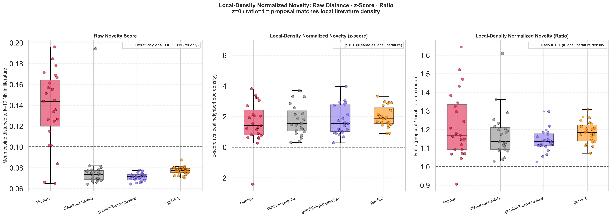
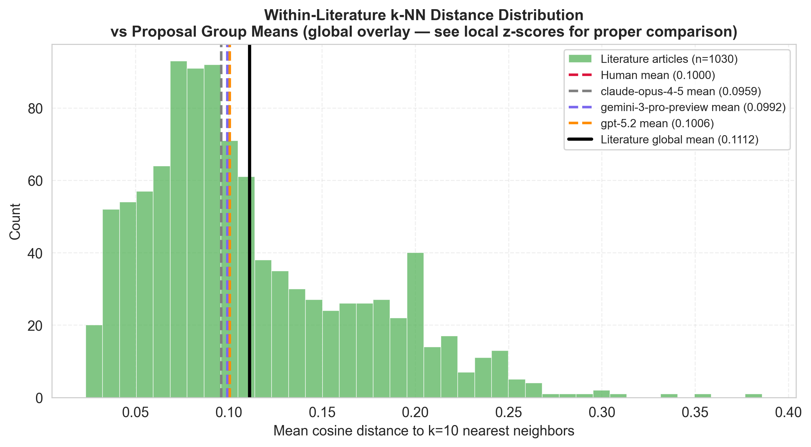

## Step 5: Raw novelty statistical tests
**Main finding:** In raw distance-to-literature space, Human proposals were generally more novel than AI (All AI mean diff `-0.0304`, MW `p=0.0356`), but after Holm correction only Claude vs Human remained clearly significant on MW (`p(Holm)=1.9690e-02`). So raw novelty differences are present but not uniformly robust across all AI models.

### Tests actually used
- **Mann-Whitney U**, **Cliff’s delta**, **bootstrap CI**, **permutation test**, **Holm correction**.

### Inferential results
- All AI vs Human: `U=560`, MW `p=3.5645e-02`, `δ=-0.2943`, mean diff `-0.0304`, 95% CI `[-0.0514, -0.0104]`, permutation `p=0.0004`, Holm MW `p=1.0693e-01`
- Claude vs Human: `U=136`, MW `p=4.9226e-03`, `δ=-0.4858`, mean diff `-0.0404`, 95% CI `[-0.0603, -0.0211]`, permutation `p=0.0003`, Holm MW `p=1.9690e-02`
- Gemini vs Human: `U=180`, MW `p=6.4978e-02`, `δ=-0.3195`, mean diff `-0.0302`, 95% CI `[-0.0523, -0.0073]`, permutation `p=0.0158`, Holm MW `p=1.2996e-01`
- GPT-5.2 vs Human: `U=244`, MW `p=6.6038e-01`, `δ=-0.0775`, mean diff `-0.0204`, 95% CI `[-0.0433, 0.0020]`, permutation `p=0.0894`, Holm MW `p=6.6038e-01`

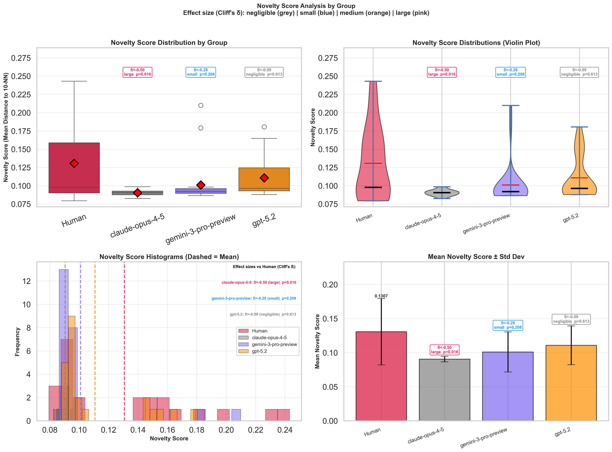

## Step 7 + nearest-literature neighbor analysis
**Main finding:** Projection and nearest-neighbor diagnostics contextualized novelty by showing where proposals lie relative to literature and which papers anchor each proposal’s neighborhood. This section is descriptive and supports interpretation of the raw/normalized novelty tests.
- Literature-space visualizations generated with t-SNE and UMAP.
- Top-10% novelty thresholds exported (`raw=0.1593`, `z=2.7213`, `ratio=1.3154`) with proposal-level table.

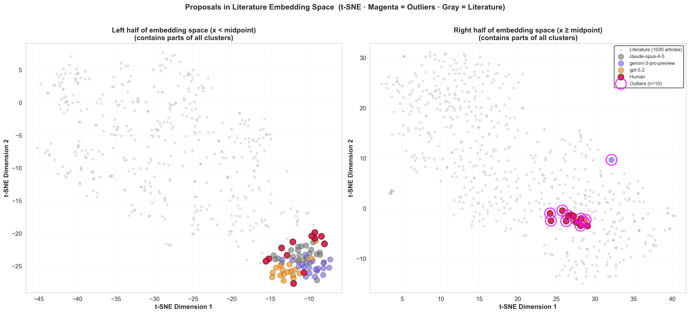
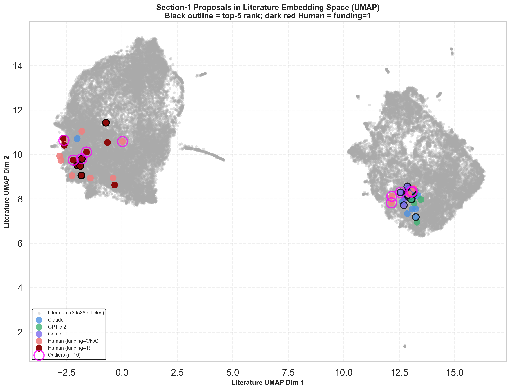
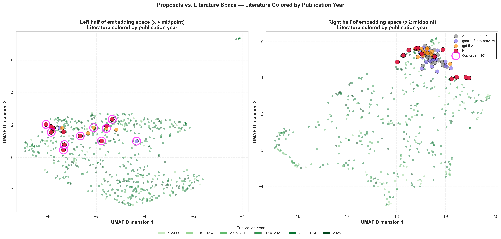

---

### PART III: Topics, clustering, and style controls

## Analysis 3.1: Topic modeling
**Main finding:** LDA produced stable topic-word structure across repeated seeds in this run, supporting internal consistency of the exploratory topic representation. This section is exploratory and does not by itself establish group-difference significance.

### Tests/diagnostics used
- LDA topic modeling with regularization.
- Stability across multiple random seeds (top-word overlap/cosine).
- k-sensitivity table reported with perplexity/log-likelihood/chi-square.

## Analysis 3.2: Topic distribution comparison
**Main finding:** Human and AI topic distributions differed significantly overall (permutation chi-square `p=0.0001`), with specific topic asymmetries after FDR correction (Topic_2 Human-up; Topic_3 AI-up). This supports a real distributional difference rather than only random variation.

### Tests actually used
- **Permutation chi-square test** for overall soft-topic distribution difference.
- **Per-topic Fisher’s exact tests**.
- **FDR correction** for per-topic tests.
- **AI subsample validation** (repeated AI subsampling to human n).

### Key results
- Overall soft-topic difference: chi-square `19.4700`, permutation `p=0.0001`.
- Topic_2 Human-up (FDR significant), Topic_3 AI-up (FDR significant).

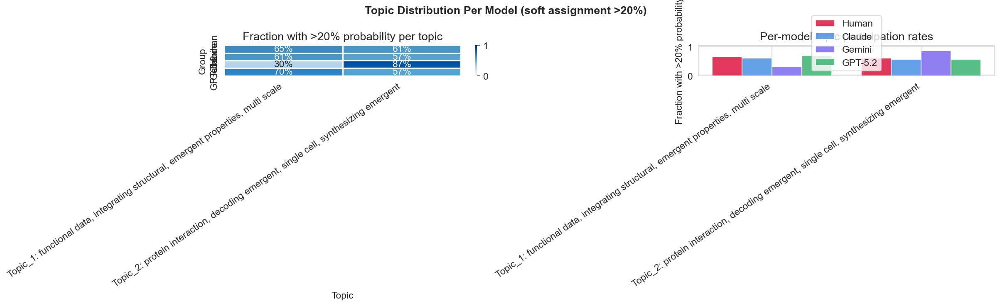

## Analysis 3.3: Topic coverage and entropy
**Main finding:** Both groups covered the same set of topics (coverage parity), but AI had markedly higher topic entropy than Human with significant subsample-based comparison (`p=0.0000`). So difference appears in distributional evenness rather than topic presence/absence.

### Tests actually used
- Coverage and exclusive-topic counts.
- **Permutation tests** on exclusivity counts.
- Shannon entropy (Miller-Madow corrected).
- Subsample comparison tests for Human vs AI entropy.

### Key results
- Coverage: Human `3/3`, AI `3/3`.
- Exclusive topics: none for either group.
- Entropy: Human `H=0.5470`; AI `H=1.5990`; subsample comparison significant (`p=0.0000`).

## Analysis 3.4: Cluster segregation
**Main finding:** Cluster/source alignment was statistically significant by multiple permutation-tested metrics (NMI `p=0.0026`, ARI `p=0.0013`, between/within ratio `p=0.0022`). This indicates non-random semantic segregation between Human and AI proposal sets.

### Tests actually used
- GMM model selection (k grid, silhouette, Davies-Bouldin, BIC).
- **Permutation tests** for:
  - NMI
  - ARI
  - between/within distance ratio

### Key results
- Selected `k=3`.
- NMI `0.0887`, `p=0.0026`.
- ARI `0.1254`, `p=0.0013`.
- Between/within ratio `1.2406`, `p=0.0022`.

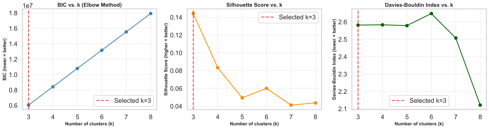
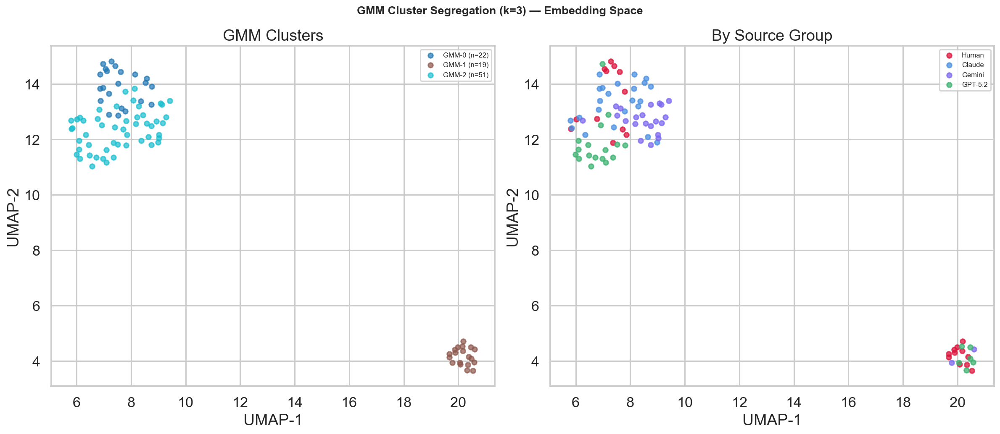

## Analysis 2.3.5: Style-only baseline
**Main finding:** Style-only features predicted Human vs AI above chance (CV AUROC `0.684 ± 0.102`, permutation `p=0.0230`), indicating measurable stylistic separability. The effect is moderate rather than near-perfect in this run.

### Tests actually used
- Logistic regression classifier on style-only features.
- Stratified cross-validation performance.
- **Permutation test** on AUROC.

### Results
- CV AUROC `0.684 ± 0.102`.
- CV balanced accuracy `0.581 ± 0.095`.
- Permutation AUROC `p=0.0230`.

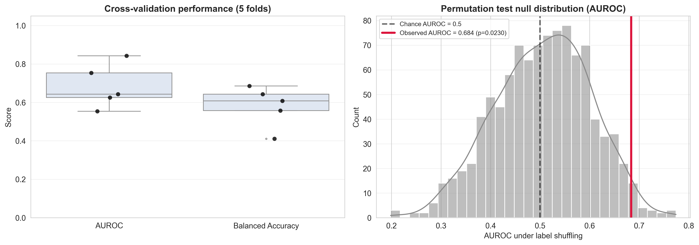

## Analysis 2.3.6: Style-controlled sensitivity
**Main finding:** After style residualization, centroid-dispersion differences remained strong (AI coefficient negative; permutation `p=0.0002`), while style-adjusted NN differences became non-significant (All AI vs Human MW `p=0.1582`, permutation `p=0.2716`). This suggests centroid-level separation is robust, but NN-based outlier conclusions are style-sensitive.

### Tests actually used
- Embedding residualization on style covariates.
- Post-adjustment group comparisons using:
  - **Mann-Whitney U**
  - **Cliff’s delta**
  - **Permutation tests**

### Style-adjusted centroid dispersion (means)
- Human `0.2872` (unadjusted shown in notebook summary), AI `0.1011` before adjustment.
- Style-adjusted group coefficient for AI indicator remained negative (`-0.174962`, permutation `p=0.0002`).
- Pairwise style-adjusted MW comparisons vs Human remained significant for all AI groups.

### Style-adjusted NN distances (means)
- Human `0.2359`
- Claude `0.2679`
- Gemini `0.3104`
- GPT-5.2 `0.2640`
- All AI `0.2808`

### How style-adjusted NN/outliers were computed
- Build covariate matrix `X` from selected style features.
- Regress embeddings on style covariates and take residual embeddings:
  - `E_resid = E - X B`, where `B` is least-squares coefficient matrix.
- L2-normalize each residual embedding row, then recompute cosine distances.
- Compute NN distance in residual space:
  - `nn_i^adj = min_{j≠i} d(E_resid_i, E_resid_j)`
- Define style-adjusted outliers by the same global top-10% rule:
  - `τ_adj = percentile_90({nn_i^adj})`
  - `is_outlier_i^adj = 1(nn_i^adj > τ_adj)` (strict `>`).
- Notebook-reported threshold in residual space: `τ_adj = 0.5212`.

### Style-adjusted NN inferential results
- All AI vs Human: `U=950`, MW `p=1.5819e-01`, `δ=0.1979`, permutation `p=0.2716`
- Claude vs Human: `U=321`, MW `p=2.1858e-01`, `δ=0.2136`, permutation `p=0.4895`
- Gemini vs Human: `U=336`, MW `p=1.1879e-01`, `δ=0.2703`, permutation `p=0.1582`
- GPT-5.2 vs Human: `U=294`, MW `p=5.3118e-01`, `δ=0.1096`, permutation `p=0.5662`

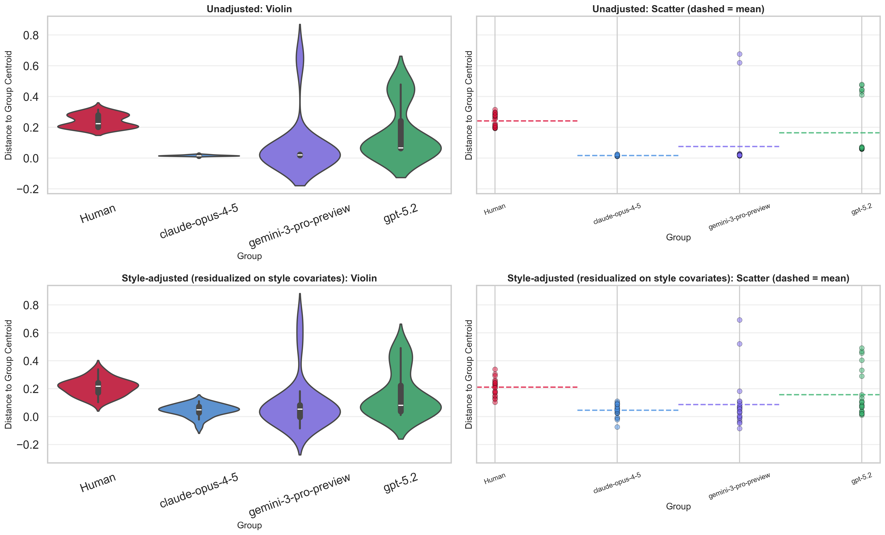
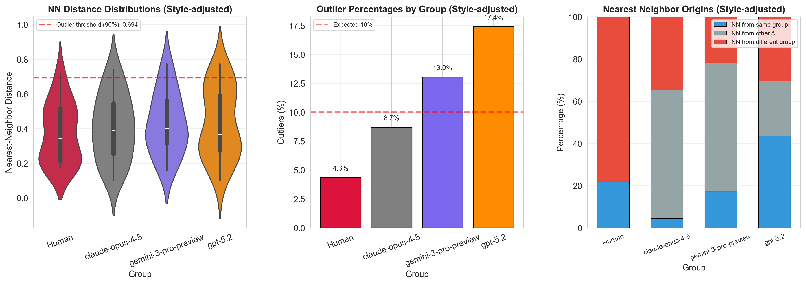
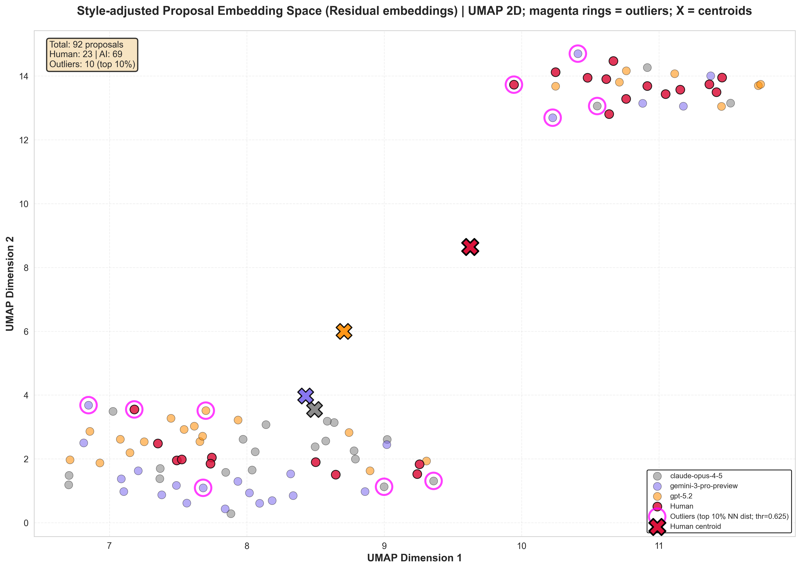

---

## 2) `compare_reviews_ncems_criteria.ipynb`

## Similarity-proxy analysis (R1)
**Main finding:** AI-vs-human review-text similarity differed by comparison type, with at least one strong significant contrast (e.g., cosine similarity `ai-ai` vs `human-ai`: `δ=1.0000`, `q=0.000110`). Reviewer-proxy behavior is therefore non-uniform across pairings.

### Tests actually used
- Pairwise review similarity metrics:
  - cosine semantic similarity
  - sentiment alignment
  - categorical sentiment agreement
- **Wilcoxon signed-rank** for paired proposal-level contrasts.
- **Mann-Whitney U** as secondary non-paired contrast.
- **Cliff’s delta** effect size.
- **FDR q-values** across comparisons.

### Example significant finding
- Cosine similarity `ai-ai` vs `human-ai`: `δ=1.0000`, `q=0.000110`.

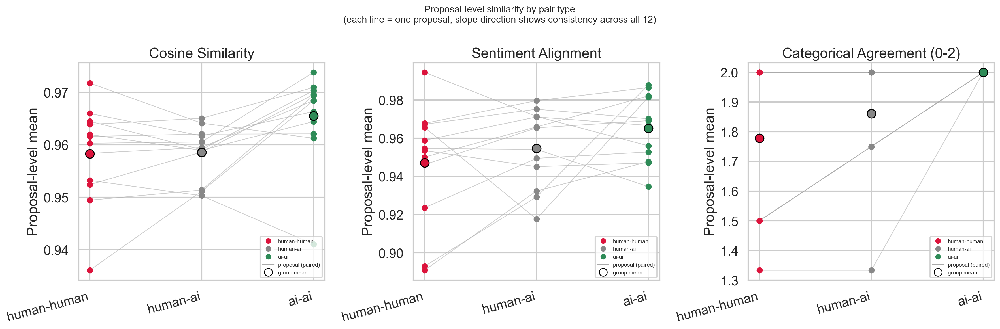
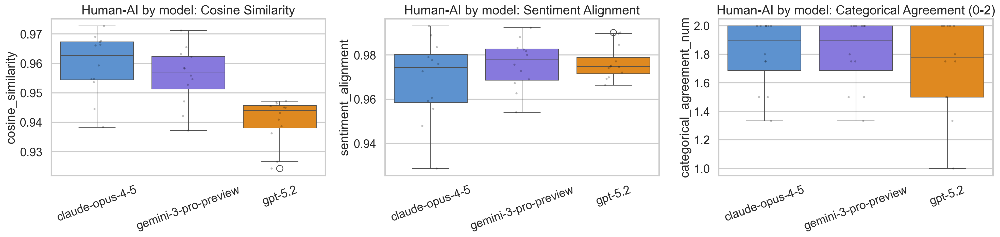
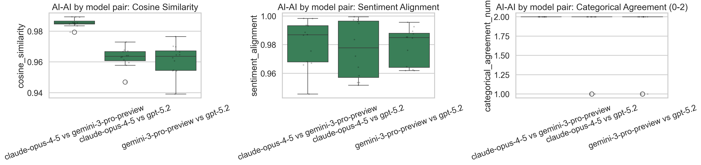

## R2: Proposal quality comparisons
**Main finding:** Under NCEMS criteria, AI-authored proposals scored higher overall than Human-all in the raw evaluator pool, with significant differences especially for GPT-5.2 and Claude (`q=1.314523e-07` and `q=5.249865e-04`, respectively). Effect sizes were large for the strongest contrasts.

### Tests actually used
- Proposal-level aggregation.
- **Mann-Whitney U** for group contrasts.
- **Cliff’s delta**.
- **FDR correction** (`q_value`) across metrics/comparisons.
- Robust sensitivity with **bootstrap CI** and **permutation p/q**.

### Criteria actually evaluated in `compare_reviews_ncems_criteria.ipynb`
- `Relevance_to_Emergent_Phenomena`
- `Novelty_and_Significance`
- `Rigor_of_Approach`
- `Scope_and_Timeline`
- `Synthesis_Focus`
- `Data_Identification`
- `Open_Science_Commitment`

### Criterion-level scores by author group (proposal-level means)

| Criterion | human-y1 | human-y2 | human-all | claude-opus-4-5 | gemini-3-pro-preview | gpt-5.2 |
|---|---:|---:|---:|---:|---:|---:|
| Relevance_to_Emergent_Phenomena | 3.527778 | 4.000000 | 3.753623 | 5.000000 | 5.000000 | 5.000000 |
| Novelty_and_Significance | 4.000000 | 4.212121 | 4.101449 | 4.333333 | 4.333333 | 4.362319 |
| Rigor_of_Approach | 3.472222 | 3.787879 | 3.623188 | 3.768116 | 3.405797 | 4.304348 |
| Scope_and_Timeline | 2.972222 | 3.121212 | 3.043478 | 3.144928 | 2.710145 | 3.347826 |
| Synthesis_Focus | 4.527778 | 4.303030 | 4.420290 | 4.985507 | 5.000000 | 5.000000 |
| Data_Identification | 3.166667 | 3.939394 | 3.536232 | 3.449275 | 3.014493 | 4.217391 |
| Open_Science_Commitment | 3.222222 | 3.666667 | 3.434783 | 4.231884 | 4.260870 | 4.681159 |

### Overall score by author group (proposal-level mean)
- human-y1: `3.441667`
- human-y2: `3.742424`
- human-all: `3.585507`
- claude-opus-4-5: `4.008696`
- gemini-3-pro-preview: `3.831884`
- gpt-5.2: `4.317391`

### Overall score (raw evaluator pool)
- Means:
  - Human-all `3.5855`
  - Claude-authored `4.0087`
  - Gemini-authored `3.8319`
  - GPT-5.2-authored `4.3174`
- Human-all vs Claude: `U=101.5`, `p=3.499910e-04`, `q=5.249865e-04`, `δ=-0.616257`
- Human-all vs Gemini: `U=158.0`, `p=1.868475e-02`, `q=1.868475e-02`, `δ=-0.402647`
- Human-all vs GPT-5.2: `U=18.5`, `p=4.381744e-08`, `q=1.314523e-07`, `δ=-0.930057`

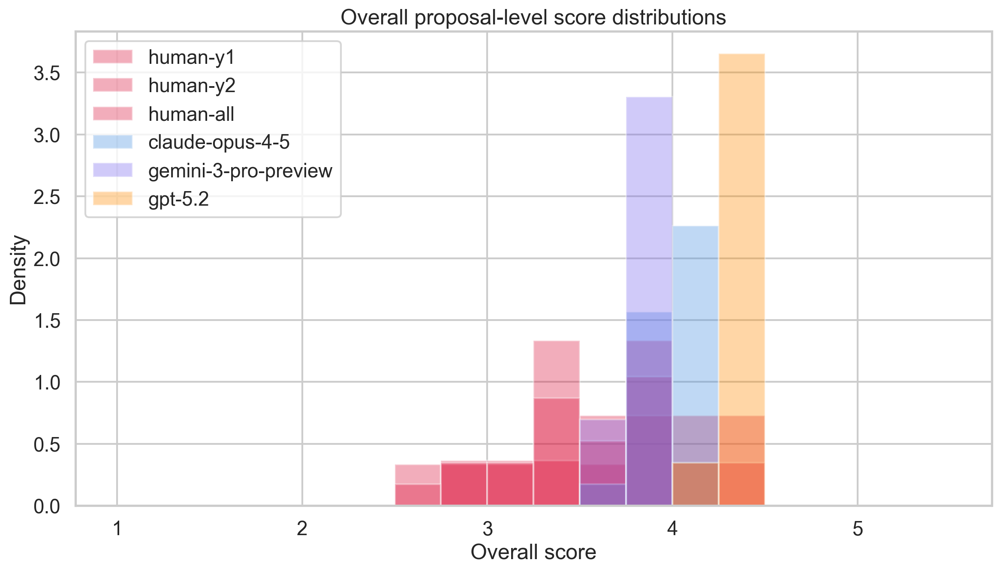
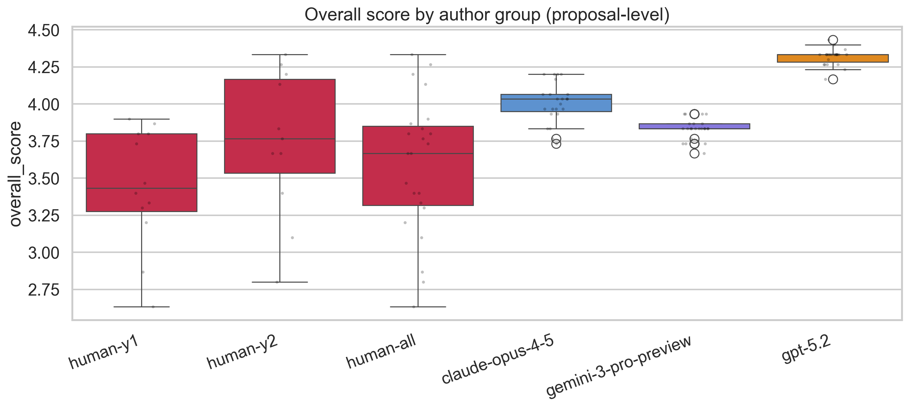
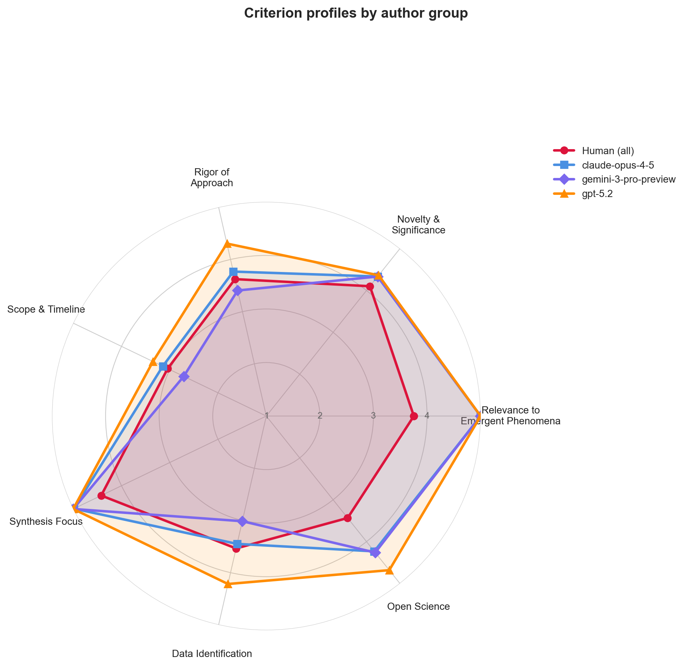
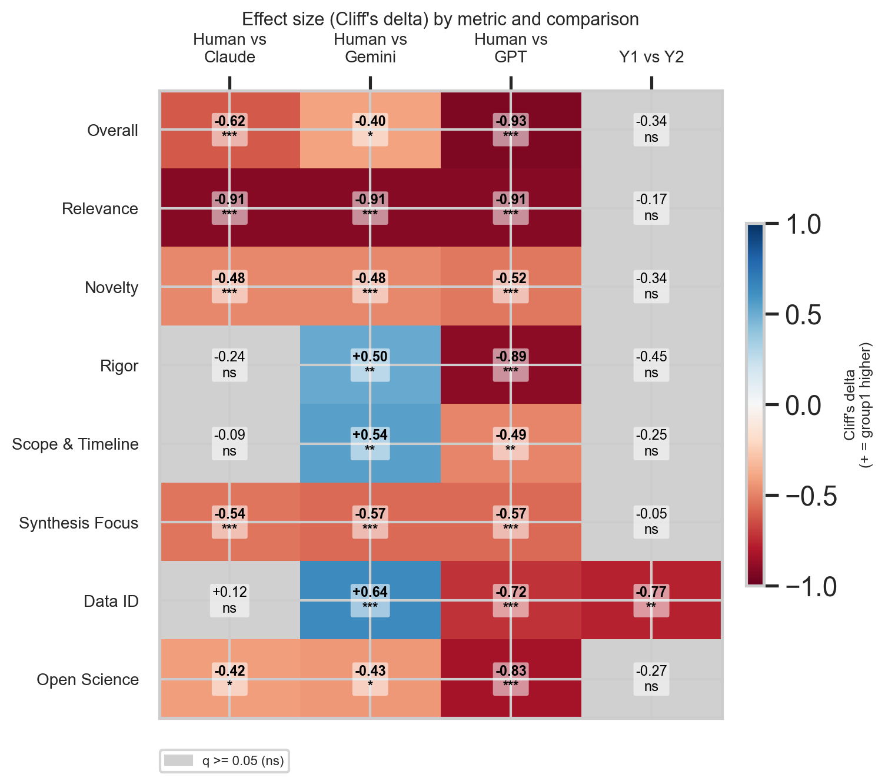
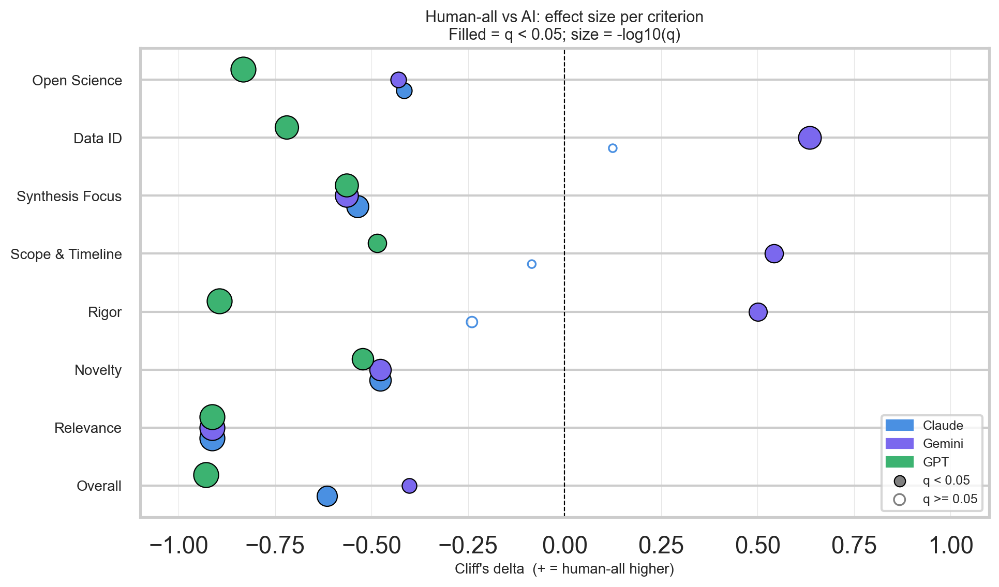

## R3: Evaluator differences and self-preference
**Main finding:** Evaluator strictness differed strongly by model (Kruskal-Wallis `p=5.20e-22`), and self-preference direction was model-dependent: Gemini was harsher on self (`δ=-0.7316`, `q=7.75e-07`) while GPT was more favorable to self (`δ=0.9329`, `q=3.30e-12`). This indicates substantial evaluator-model bias structure.

### Tests actually used
- **Kruskal-Wallis** for evaluator-level distribution differences.
- Self-preference contrasts with **Mann-Whitney U**, **Cliff’s delta**, **FDR q**.
- **Fixed-effects regression** (proposal controls and criterion controls).

### Evaluator-level means
- Gemini evaluator `4.3011`
- Claude evaluator `3.7837`
- GPT evaluator `3.7228`
- Kruskal-Wallis: `p=5.201491899055386e-22`

### Overall self-preference (overall score)
- Claude evaluator: self `3.8783`, other `3.8870`, `U=501.0`, `p=7.173364e-01`, `δ=-0.052930`
- Gemini evaluator: self `4.1435`, other `4.5304`, `U=142.0`, `p=5.166161e-07`, `δ=-0.731569`, `q=7.749241e-07`
- GPT evaluator: self `4.0043`, other `3.8065`, `U=1022.5`, `p=1.100302e-12`, `δ=0.932892`, `q=3.300906e-12`

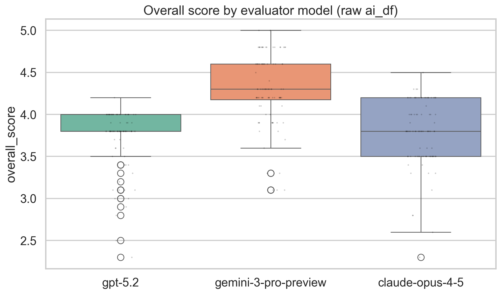
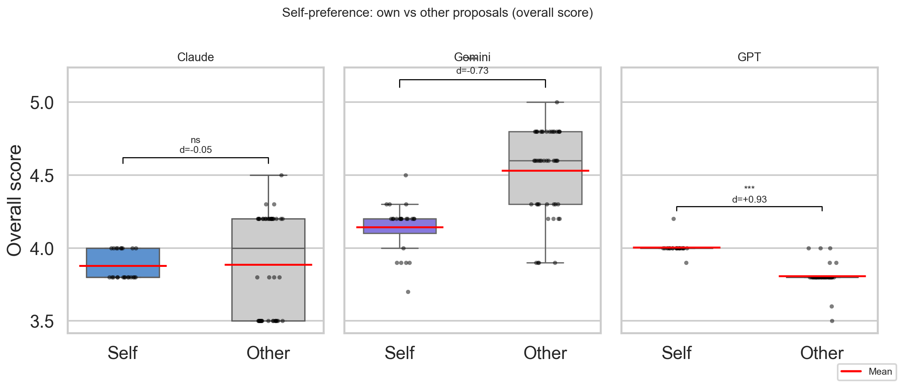
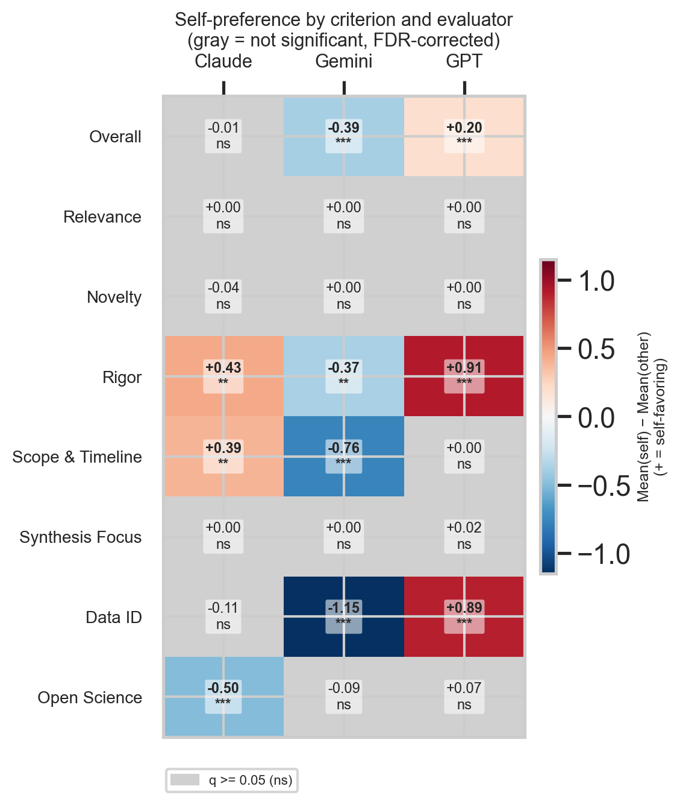
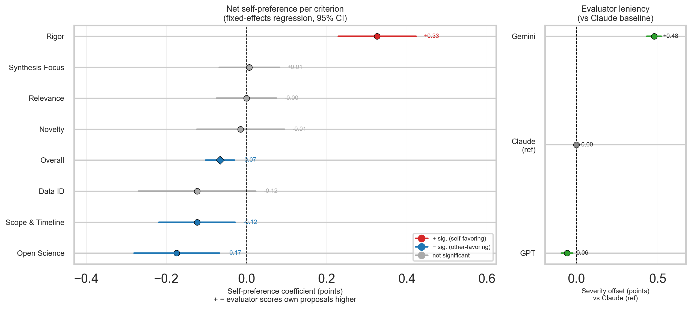

## Bias-control rerun (self-evaluations removed)
**Main finding:** After removing AI self-evaluations, GPT-5.2 remained significantly above Human-all (`q=1.702623e-08`), Claude also remained above Human-all (`q=2.252824e-04`), while Gemini vs Human-all became non-significant (`q=0.6815845`). So bias control changed some rankings but did not remove all human–AI differences under NCEMS scoring.

### What changed
- Removed `69` self-evaluation rows, remaining `207`.

### Criteria and criterion-level scores after removal (cross-evaluator-only)
Criteria are the same NCEMS criteria:
- `Relevance_to_Emergent_Phenomena`
- `Novelty_and_Significance`
- `Rigor_of_Approach`
- `Scope_and_Timeline`
- `Synthesis_Focus`
- `Data_Identification`
- `Open_Science_Commitment`

| Criterion | human-y1 | human-y2 | human-all | claude-opus-4-5 | gemini-3-pro-preview | gpt-5.2 |
|---|---:|---:|---:|---:|---:|---:|
| Relevance_to_Emergent_Phenomena | 3.527778 | 4.000000 | 3.753623 | 5.000000 | 5.000000 | 5.000000 |
| Novelty_and_Significance | 4.000000 | 4.212121 | 4.101449 | 4.500000 | 4.000000 | 4.543478 |
| Rigor_of_Approach | 3.472222 | 3.787879 | 3.623188 | 3.673913 | 3.021739 | 4.456522 |
| Scope_and_Timeline | 2.972222 | 3.121212 | 3.043478 | 3.217391 | 2.586957 | 3.521739 |
| Synthesis_Focus | 4.527778 | 4.303030 | 4.420290 | 4.978261 | 5.000000 | 5.000000 |
| Data_Identification | 3.166667 | 3.939394 | 3.536232 | 3.478261 | 3.000000 | 4.326087 |
| Open_Science_Commitment | 3.222222 | 3.666667 | 3.434783 | 4.347826 | 4.000000 | 5.000000 |

### Overall score after removal
- Means:
  - Human-all `3.5855`
  - Claude-authored `4.0739`
  - Gemini-authored `3.6761`
  - GPT-5.2-authored `4.4739`
- Human-all vs Claude: `U=92.0`, `p=1.501883e-04`, `q=2.252824e-04`, `δ=-0.652174`
- Human-all vs Gemini: `U=283.0`, `p=6.815845e-01`, `q=6.815845e-01`, `δ=0.069943`
- Human-all vs GPT-5.2: `U=2.0`, `p=5.675408e-09`, `q=1.702623e-08`, `δ=-0.992439`

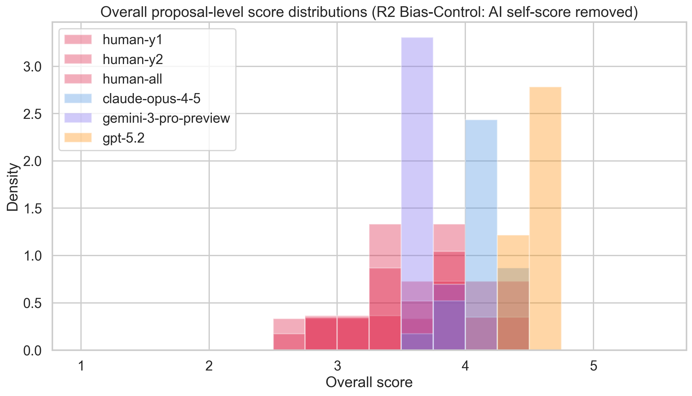
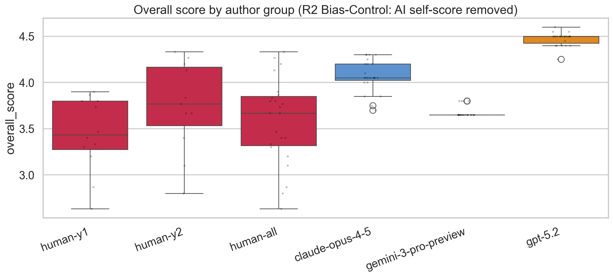
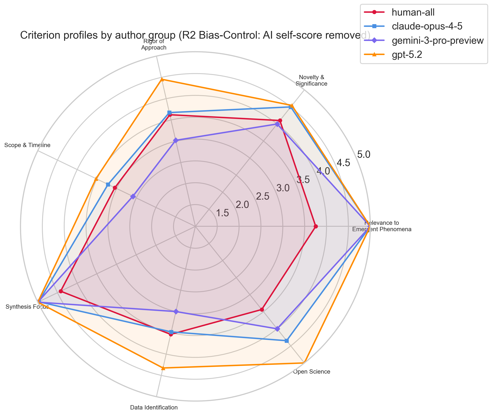
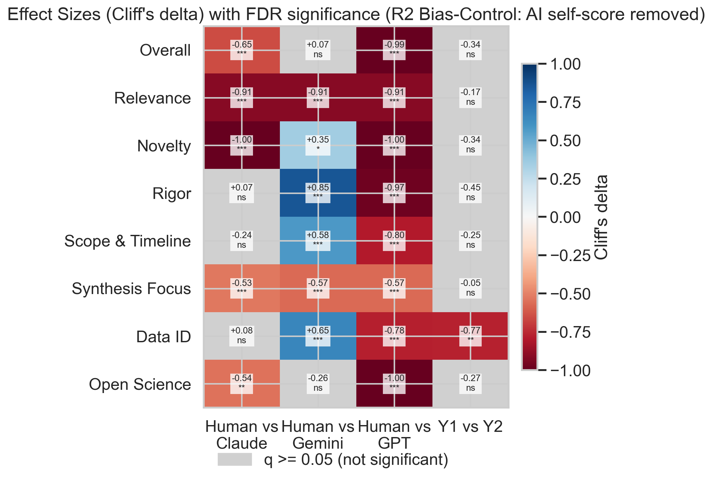
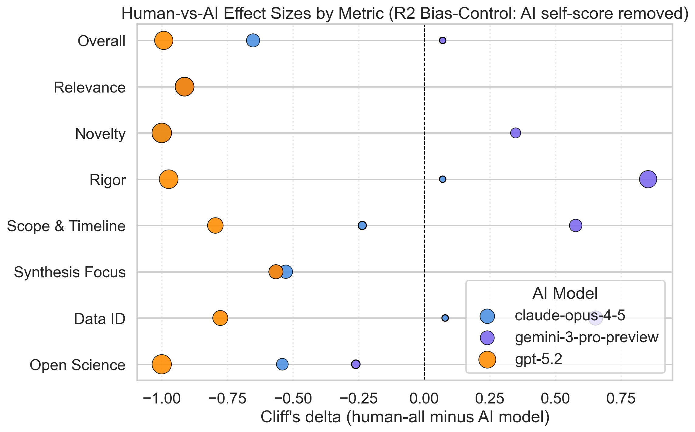

---

## 3) `compare_reviews_novelty.ipynb`

## R2: Novelty-criteria proposal quality
**Main finding:** Under novelty criteria, results were mixed: Human-all was significantly above Claude (`q=0.001252`), GPT-5.2 was significantly above Human-all (`q=0.010149`), and Human-all vs Gemini was not significant (`q=0.279937`). This contrasts with the clearer NCEMS pattern and shows criterion-framework dependence.

### Tests actually used
- Proposal-level aggregation.
- **Mann-Whitney U**, **Cliff’s delta**, **FDR q-values**.
- Robust bootstrap/permutation sensitivity tables.

### Criteria actually evaluated in `compare_reviews_novelty.ipynb`
- `new_question_topic_or_framing`
- `new_theory_concept_method_dataset_or_design`
- `unusual_combination_of_existing_ideas`
- `beyond_state_of_the_art`
- `credible_high_risk_high_gain`
- `unique_knowledge_generation`

### Criterion-level scores by author group (proposal-level means)

| Criterion | human-y1 | human-y2 | human-all | claude-opus-4-5 | gemini-3-pro-preview | gpt-5.2 |
|---|---:|---:|---:|---:|---:|---:|
| new_question_topic_or_framing | 3.666667 | 4.060606 | 3.855072 | 3.347826 | 3.594203 | 3.942029 |
| new_theory_concept_method_dataset_or_design | 3.472222 | 3.803030 | 3.630435 | 3.000000 | 3.289855 | 3.615942 |
| unusual_combination_of_existing_ideas | 4.222222 | 4.287879 | 4.253623 | 4.072464 | 4.304348 | 4.760870 |
| beyond_state_of_the_art | 3.472222 | 3.636364 | 3.550725 | 3.268116 | 3.420290 | 3.913043 |
| credible_high_risk_high_gain | 3.472222 | 3.606061 | 3.536232 | 3.282609 | 3.652174 | 3.724638 |
| unique_knowledge_generation | 3.916667 | 4.287879 | 4.094203 | 3.978261 | 3.971014 | 4.333333 |

### Overall score by author group (proposal-level mean)
- human-y1: `3.644444`
- human-y2: `3.895455`
- human-all: `3.764493`
- claude-opus-4-5: `3.402899`
- gemini-3-pro-preview: `3.656522`
- gpt-5.2: `3.993478`

### Overall score (raw evaluator pool)
- Means:
  - Human-all `3.7645`
  - Claude-authored `3.4029`
  - Gemini-authored `3.6565`
  - GPT-5.2-authored `3.9935`
- Human-all vs Claude: `U=425.0`, `p=4.17e-04`, `q=0.001252`, `δ=0.606805`
- Human-all vs Gemini: `U=314.0`, `p=0.279937`, `q=0.279937`, `δ=0.187146`
- Human-all vs GPT-5.2: `U=141.0`, `p=0.006766`, `q=0.010149`, `δ=-0.466919`

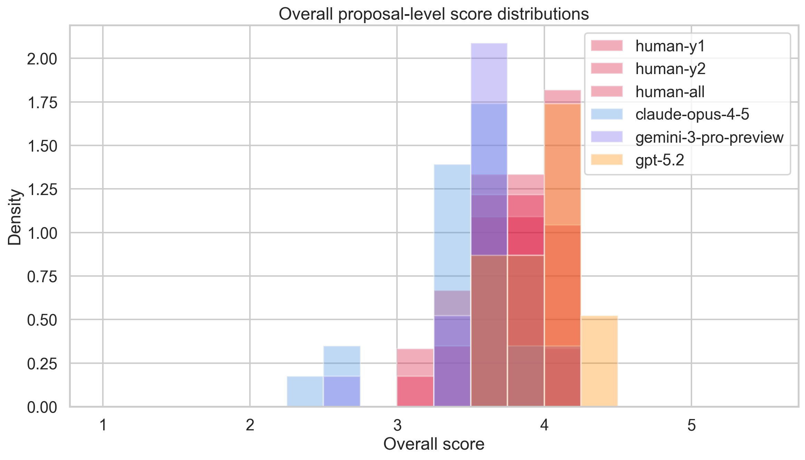
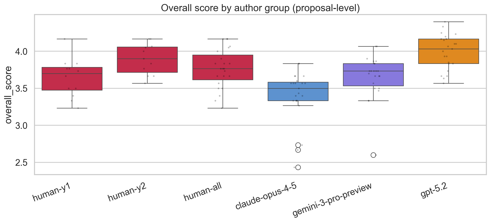
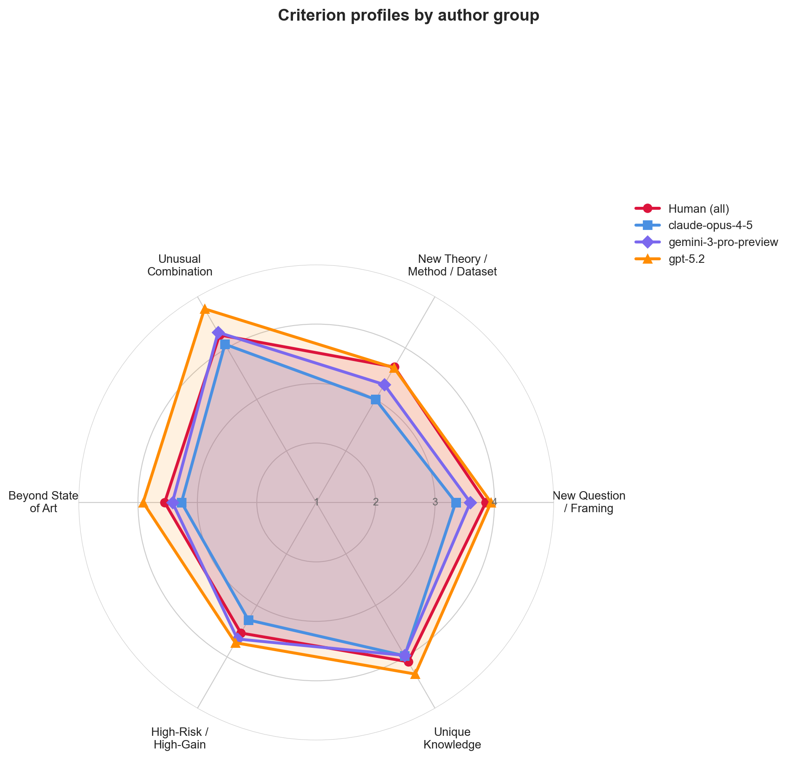
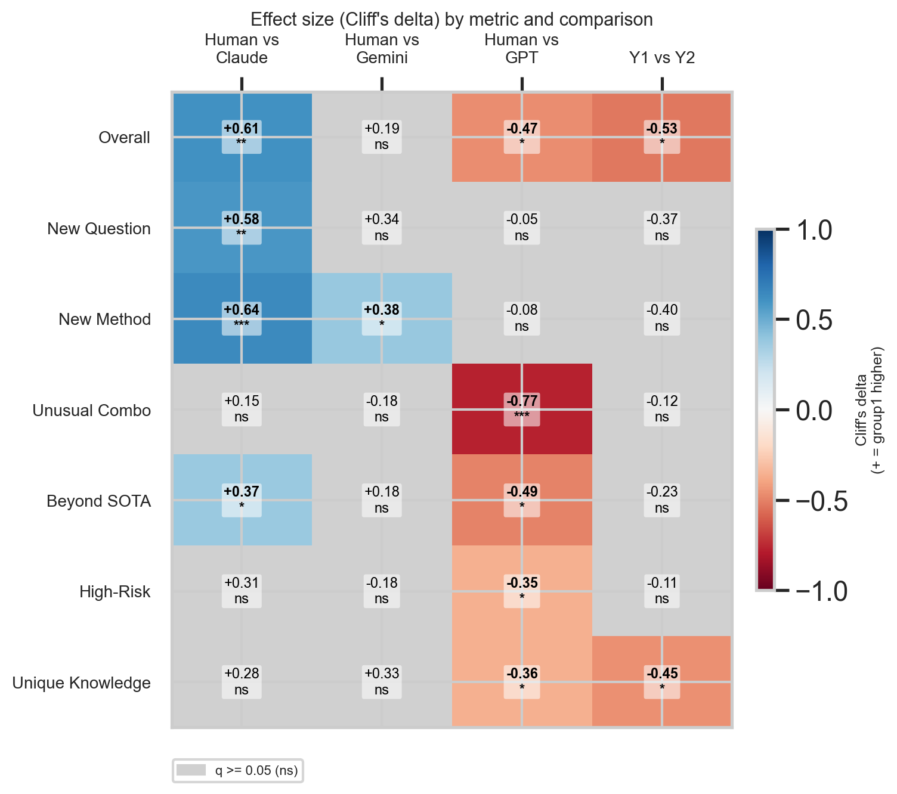
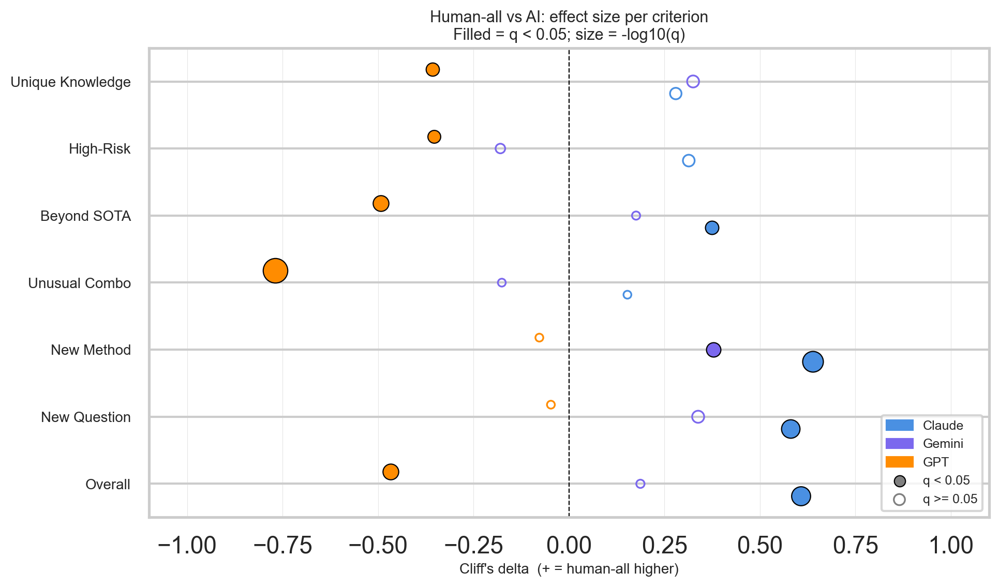

## R3: Evaluator differences and self-preference
**Main finding:** Evaluator differences were very strong (Kruskal-Wallis `p=1.51e-33`), and self-preference again depended on model direction: Claude self-lower (`q=0.000173`), Gemini modest self-higher (`q=0.043942`), GPT self-higher (`q=0.000024`). Bias patterns therefore generalize across scoring frameworks but with different signs/magnitudes.

### Tests actually used
- **Kruskal-Wallis** evaluator test.
- Self-preference with **Mann-Whitney U**, **Cliff’s delta**, **FDR q**.
- **Fixed-effects regression** + forest plot.

### Evaluator-level means
- Gemini evaluator `4.1750`
- GPT evaluator `3.7043`
- Claude evaluator `3.1779`
- Kruskal-Wallis `p=1.5116610558863968e-33`

### Overall self-preference (overall score)
- Claude evaluator: self `2.8864`, other `3.2857`, `U=215.0`, `p=0.000115`, `δ=-0.534632`, `q=0.000173`
- Gemini evaluator: self `4.3000`, other `4.0500`, `U=683.0`, `p=0.043942`, `δ=0.291115`, `q=0.043942`
- GPT evaluator: self `3.9217`, other `3.6000`, `U=865.0`, `p=0.000008`, `δ=0.635161`, `q=0.000024`

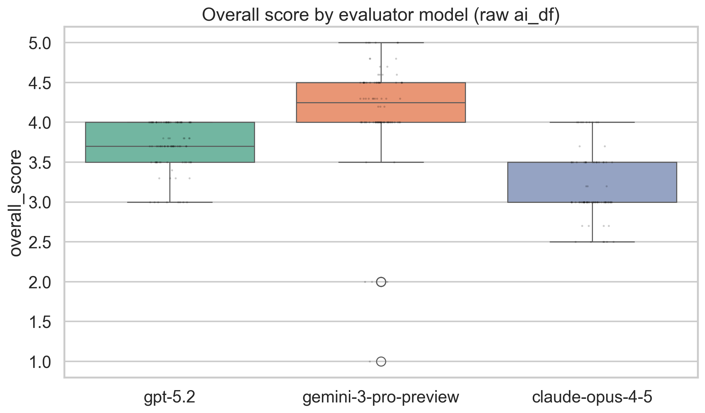
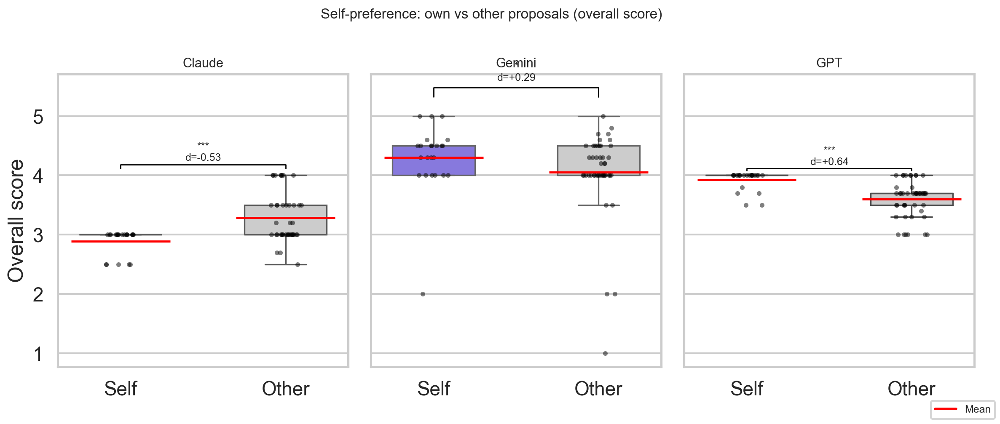
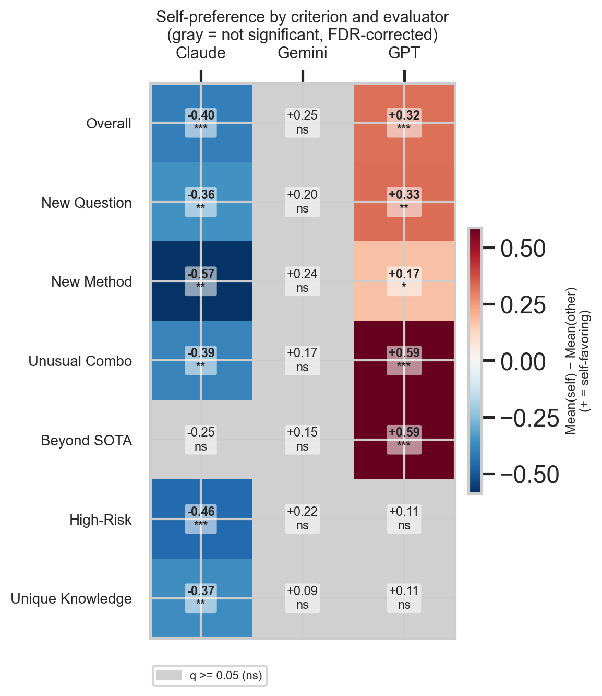
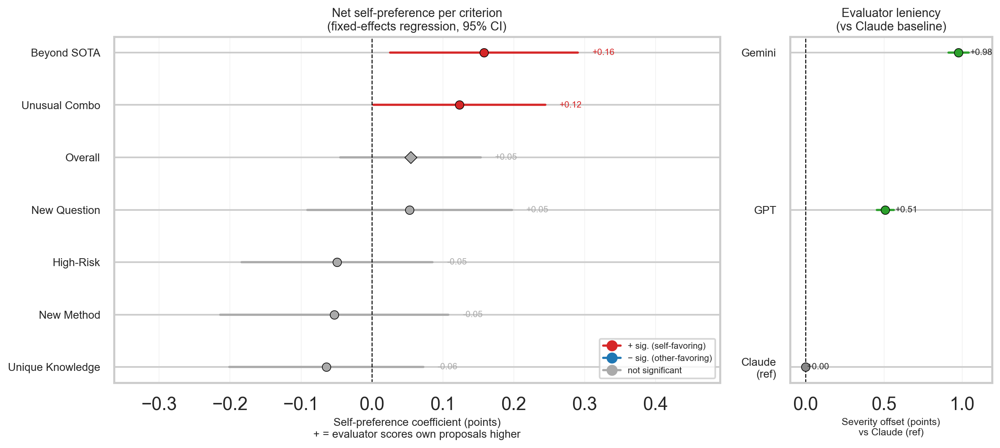

## Bias-control rerun (self-evaluations removed)
**Main finding:** With self-evaluations removed, Human-all was significantly above Gemini (`q=1.786758e-05`), GPT-5.2 remained significantly above Human-all (`q=0.01092399`), and Claude vs Human-all was non-significant (`q=0.8427877`). This confirms that novelty-quality conclusions are sensitive to evaluator composition.
- Removed `69` self-evaluation rows; remaining `207`.

### Criteria and criterion-level scores after removal (cross-evaluator-only)
Criteria are the same novelty criteria:
- `new_question_topic_or_framing`
- `new_theory_concept_method_dataset_or_design`
- `unusual_combination_of_existing_ideas`
- `beyond_state_of_the_art`
- `credible_high_risk_high_gain`
- `unique_knowledge_generation`

| Criterion | human-y1 | human-y2 | human-all | claude-opus-4-5 | gemini-3-pro-preview | gpt-5.2 |
|---|---:|---:|---:|---:|---:|---:|
| new_question_topic_or_framing | 3.666667 | 4.060606 | 3.855072 | 3.521739 | 3.391304 | 3.956522 |
| new_theory_concept_method_dataset_or_design | 3.472222 | 3.803030 | 3.630435 | 3.217391 | 2.913043 | 3.891304 |
| unusual_combination_of_existing_ideas | 4.222222 | 4.287879 | 4.253623 | 4.239130 | 4.043478 | 4.760870 |
| beyond_state_of_the_art | 3.472222 | 3.636364 | 3.550725 | 3.500000 | 3.000000 | 3.978261 |
| credible_high_risk_high_gain | 3.472222 | 3.606061 | 3.536232 | 3.608696 | 3.500000 | 3.608696 |
| unique_knowledge_generation | 3.916667 | 4.287879 | 4.094203 | 4.347826 | 3.500000 | 4.543478 |

### Overall score after removal
- Means:
  - Human-all `3.7645`
  - Claude-authored `3.6478`
  - Gemini-authored `3.3348`
  - GPT-5.2-authored `4.0543`
- Human-all vs Claude: `U=274.0`, `p=0.8427877`, `q=0.8427877`, `δ=0.035917`
- Human-all vs Gemini: `U=470.5`, `p=5.955861e-06`, `q=1.786758e-05`, `δ=0.778828`
- Human-all vs GPT-5.2: `U=142.0`, `p=0.007282657`, `q=0.01092399`, `δ=-0.463138`

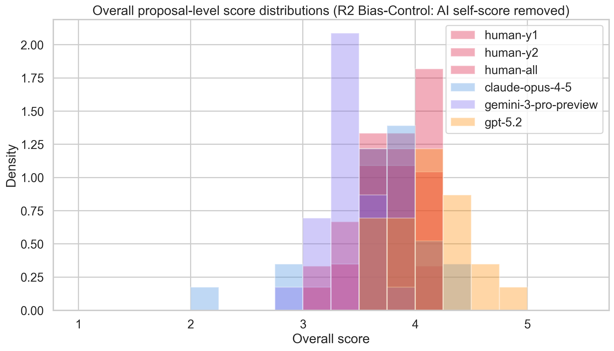
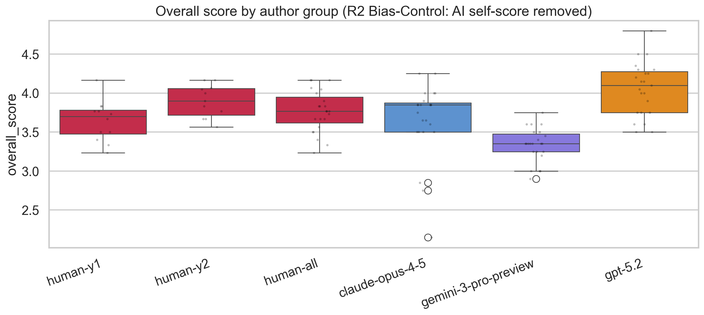
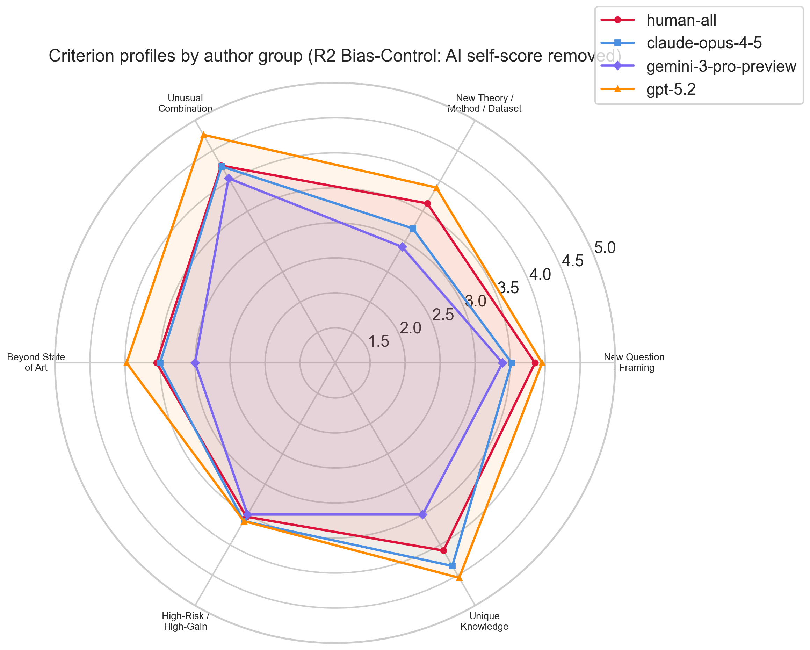
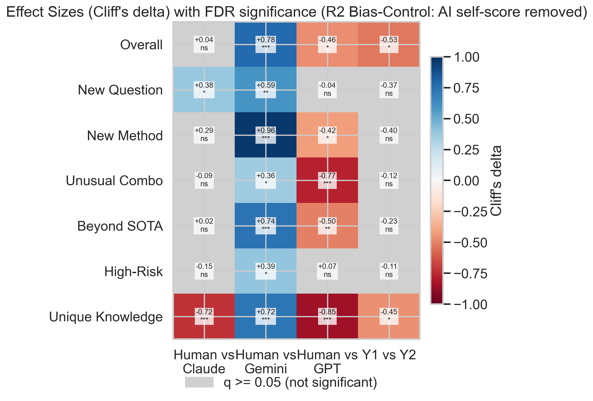
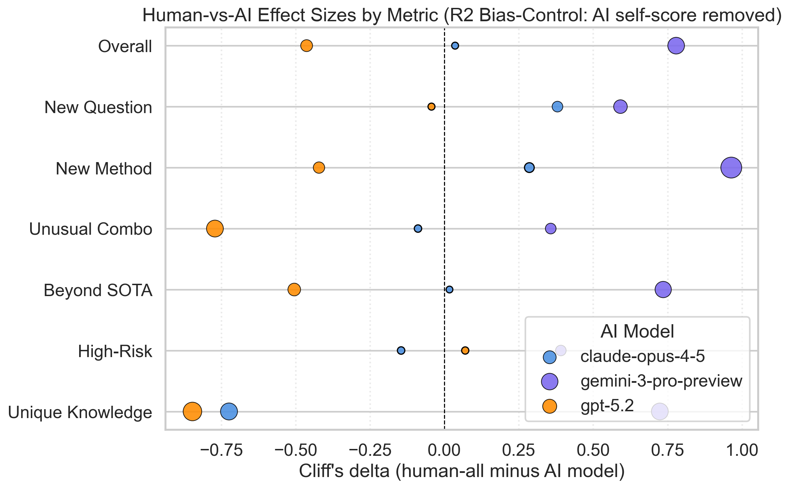

---

## 4) `metric_score_relationship.ipynb`

## Data integration
**Main finding:** This step merged all proposal-level metrics with both review frameworks into a single analysis table (`92 x 52`) with complete evaluator coverage (`276` NCEMS + `276` novelty reviews). It is a data-prep stage and does not involve a significance test.

- Unified proposal table: `92 x 52`.
- Parsed reviews: `276` NCEMS and `276` novelty reviews.

## Correlation analyses
**Main finding:** Semantic metrics were strongly negatively associated with NCEMS-type scores (e.g., `r=-0.6496` for `mi_pairwise_mean_dist` vs relevance) and positively associated with novelty-oriented scores (e.g., `r=0.5093` for `centroid_dist` vs new-theory criterion). This indicates a tradeoff between “novel/remote” structure and conservative evaluation criteria.

### Tests actually used
- **Spearman correlation** for metric-score matrices.
- Corresponding p-value tables exported.

### Top reported correlations
- Semantic vs NCEMS:
  - `mi_pairwise_mean_dist` vs `relevance_to_emergent_phenomena`: `r=-0.6496`
  - `mi_nn_dist` vs `review_score_mean`: `r=-0.3943`
- Semantic vs novelty criteria:
  - `centroid_dist` vs `new_theory_concept_method_dataset_or_design`: `r=0.5093`
  - `centroid_dist` vs `new_question_topic_or_framing`: `r=0.4668`

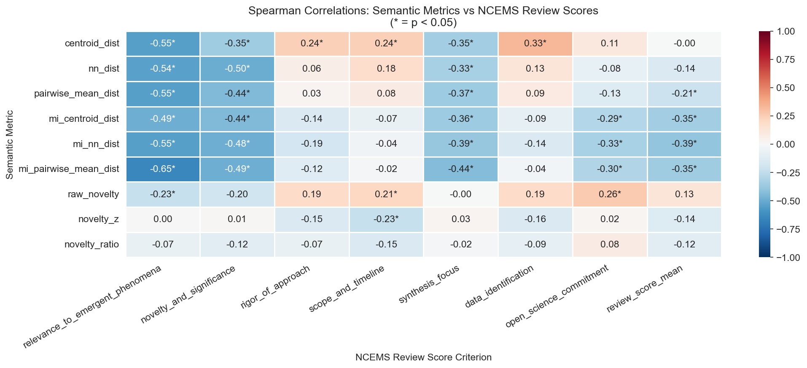
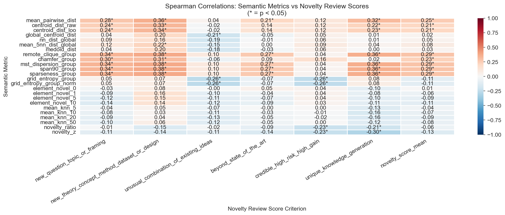
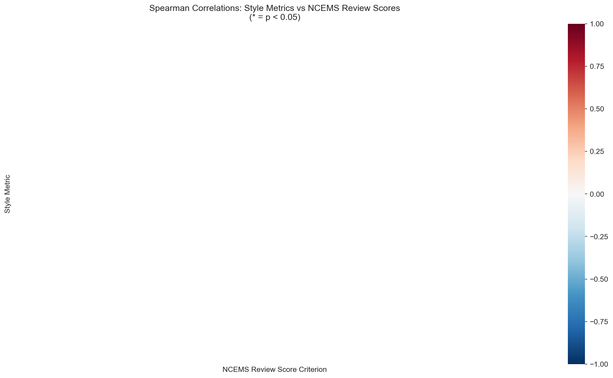
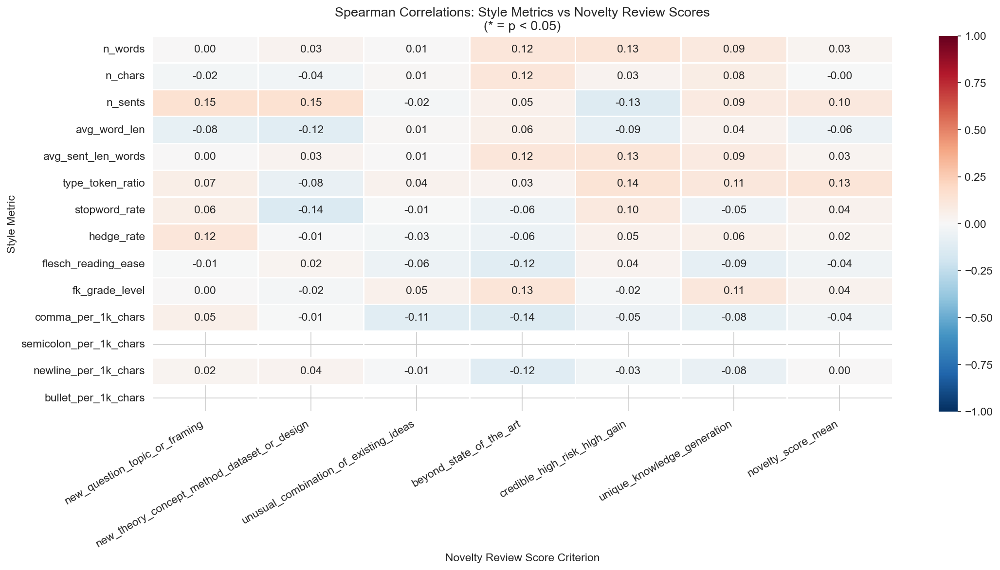

## Outlier validation
**Main finding:** Semantically outlier proposals tended to score worse on key NCEMS dimensions (notably relevance and novelty/significance) but could score higher on at least one novelty-specific dimension (`new_theory...`, `p=0.0273`). Outlier status therefore has criterion-dependent consequences.

### Tests actually used
- For each outlier flag, criterion means were compared with **Mann-Whitney U** and p-values.

### Example findings
- NCEMS side (`is_outlier`):
  - Relevance lower in outliers (`3.6333` vs `4.8171`, `p<0.001`)
  - Novelty & significance lower in outliers (`4.0333` vs `4.3130`, `p=0.0001`)
- Novelty-review side (`is_outlier`):
  - `new_theory_concept_method_dataset_or_design` higher for outliers (`3.7333` vs `3.3415`, `p=0.0273`)

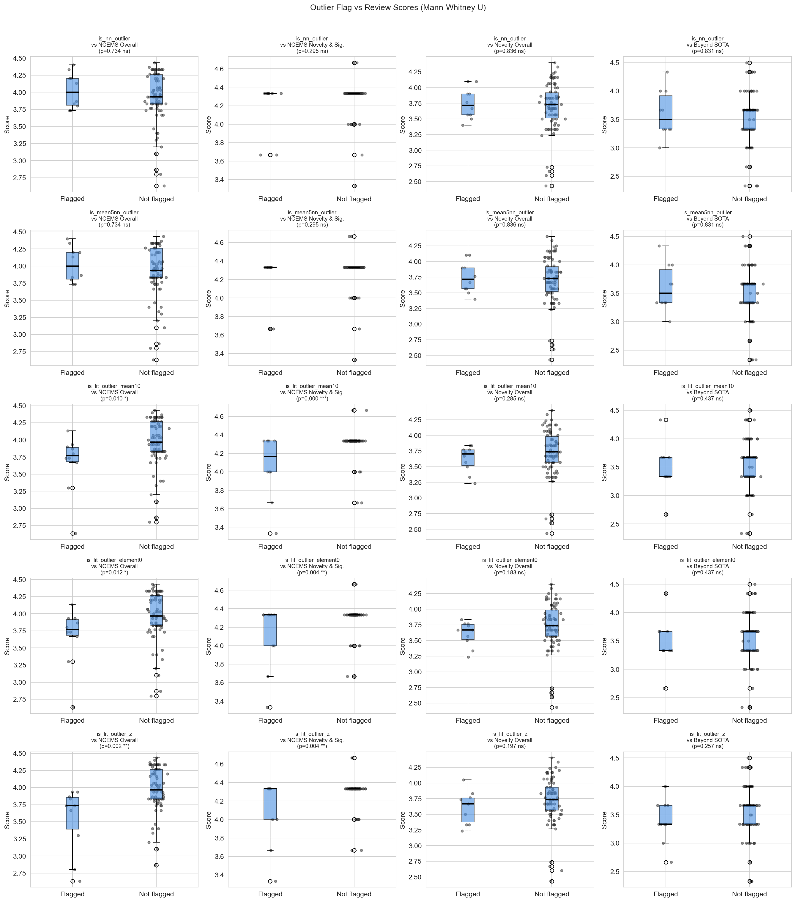
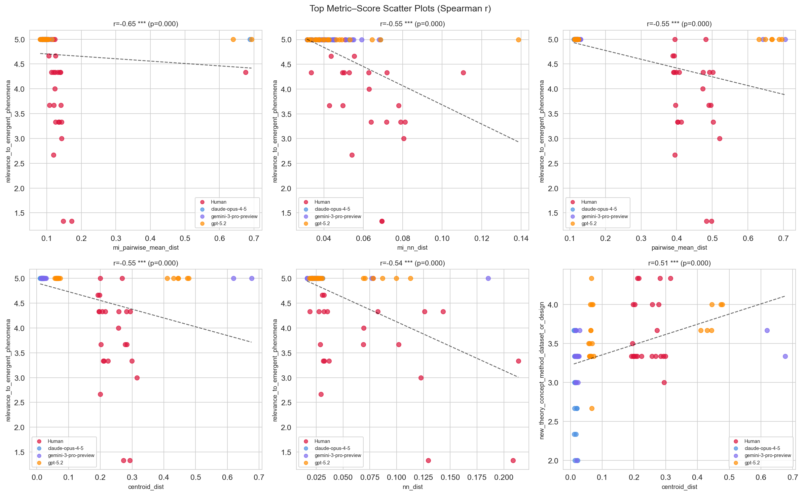
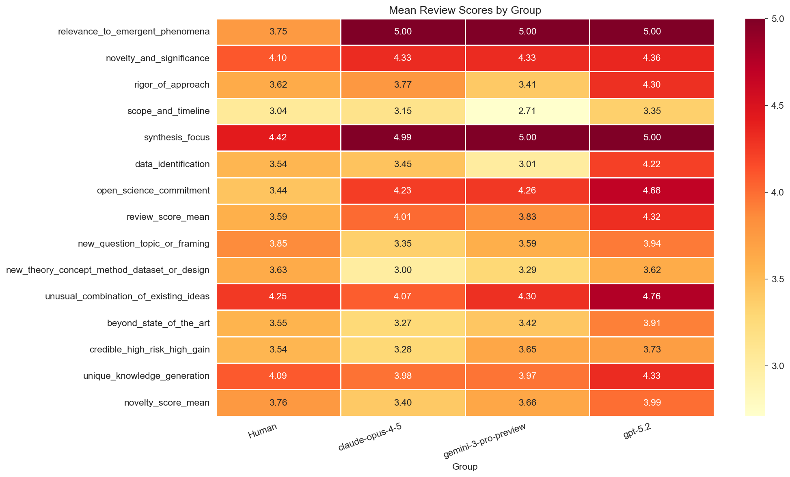
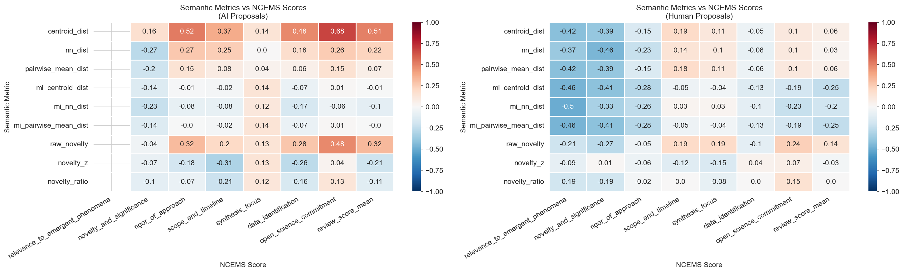
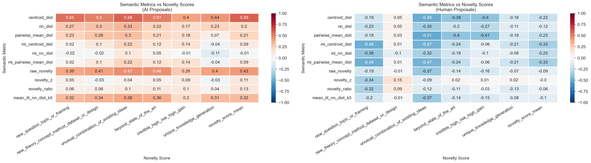
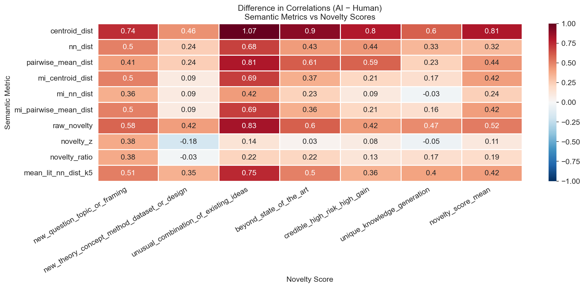
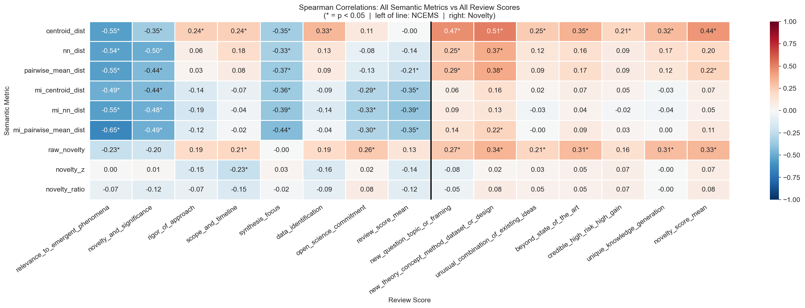

---

## Overall synthesis
1. In raw full-text embedding space, Human proposals show higher diversity/dispersion/isolation than AI proposals.
2. Topic and clustering analyses indicate significant Human/AI semantic-region differences.
3. Raw novelty favors Human on average, but local-density normalization weakens between-group novelty claims.
4. Style carries measurable source signal and affects some downstream conclusions, but not all.
5. Review-based “quality” conclusions depend strongly on scoring framework (NCEMS vs novelty) and evaluator-specific bias patterns.
